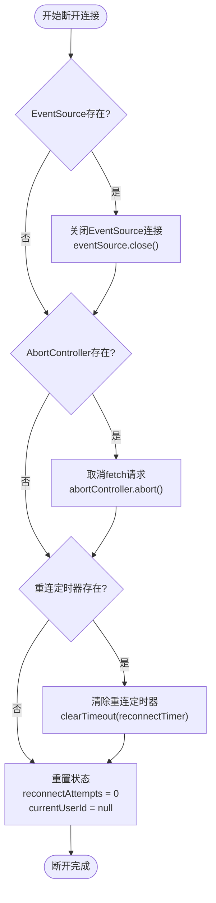
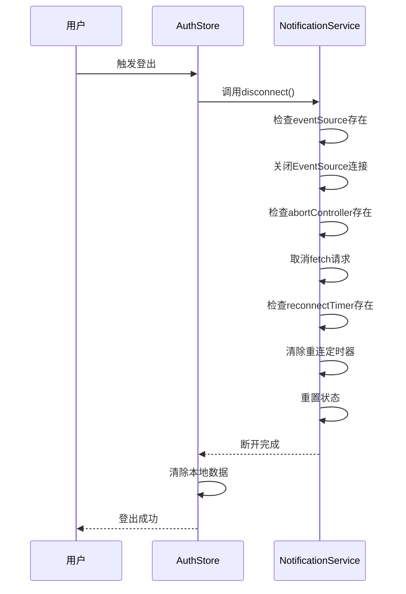

# SSE连接断开与资源清理

<cite>
**Referenced Files in This Document**  
- [notification.ts](file://src/services/notification.ts)
- [auth.ts](file://src/stores/auth.ts)
</cite>

## 目录
1. [引言](#引言)
2. [SSE连接管理机制](#sse连接管理机制)
3. [双重清理策略](#双重清理策略)
4. [登出时的完整资源释放流程](#登出时的完整资源释放流程)
5. [清理步骤的必要性分析](#清理步骤的必要性分析)
6. [断开过程中的状态变化与调试信息](#断开过程中的状态变化与调试信息)
7. [结论](#结论)

## 引言
在现代Web应用中，服务器发送事件（SSE）是一种重要的实时通信技术。然而，不当的连接管理可能导致内存泄漏和无效连接残留，影响系统性能和稳定性。本文档旨在系统阐述SSE连接的安全断开与资源管理机制，重点分析`disconnect`方法如何通过`AbortController.abort()`终止fetch请求流，以及`EventSource.close()`关闭传统连接的双重清理策略。同时，详细描述登出时调用`notificationService.disconnect()`的完整资源释放流程，包括连接实例置空、重连定时器清除、状态重置等操作，确保开发者能准确理解连接生命周期管理。

## SSE连接管理机制
SSE连接管理机制是确保实时通信稳定性和资源高效利用的关键。在本系统中，`NotificationService`类负责管理SSE连接，通过`connect`和`disconnect`方法实现连接的建立与断开。`connect`方法使用`fetch` API发起SSE请求，并通过`AbortController`控制请求的生命周期。`disconnect`方法则负责安全地断开连接，释放相关资源。

**Section sources**
- [notification.ts](file://src/services/notification.ts#L25-L145)

## 双重清理策略
双重清理策略是指在断开SSE连接时，同时使用`AbortController.abort()`和`EventSource.close()`两种方法，确保连接被彻底终止。这种策略能够有效防止因单一方法失效而导致的连接残留问题。

### AbortController.abort() 方法
`AbortController.abort()`方法用于取消fetch请求流。当调用此方法时，fetch请求会被立即终止，相关的流读取操作也会停止。这对于使用`fetch` API发起的SSE请求尤为重要，因为`EventSource`对象无法直接控制`fetch`请求。

### EventSource.close() 方法
`EventSource.close()`方法用于关闭传统的SSE连接。当调用此方法时，`EventSource`对象会断开与服务器的连接，并将`readyState`属性设置为`CLOSED`。这对于确保连接状态的正确性至关重要。

**Diagram sources**
- [notification.ts](file://src/services/notification.ts#L147-L185)

**Section sources**
- [notification.ts](file://src/services/notification.ts#L147-L185)

## 登出时的完整资源释放流程
登出时的完整资源释放流程是确保系统资源高效利用的重要环节。当用户登出时，`useAuthStore`中的`logout`方法会调用`notificationService.disconnect()`，触发一系列资源释放操作。

### 调用流程
1. 用户触发登出操作。
2. `useAuthStore`中的`logout`方法被调用。
3. `logout`方法调用`notificationService.disconnect()`。
4. `disconnect`方法执行双重清理策略，断开SSE连接。
5. 清除本地存储的token和用户信息。

### 资源释放操作
- **连接实例置空**：将`eventSource`和`abortController`设置为`null`，释放连接实例。
- **重连定时器清除**：使用`clearTimeout`清除重连定时器，防止定时器继续执行。
- **状态重置**：将`reconnectAttempts`和`currentUserId`重置为初始值，确保状态一致性。

**Diagram sources**
- [auth.ts](file://src/stores/auth.ts#L180-L198)
- [notification.ts](file://src/services/notification.ts#L147-L185)

**Section sources**
- [auth.ts](file://src/stores/auth.ts#L180-L198)
- [notification.ts](file://src/services/notification.ts#L147-L185)

## 清理步骤的必要性分析
清理步骤的必要性在于防止内存泄漏和无效连接残留，确保系统的稳定性和性能。

### 防止内存泄漏
- **连接实例置空**：如果不将`eventSource`和`abortController`设置为`null`，这些对象将继续占用内存，导致内存泄漏。
- **重连定时器清除**：如果不清除重连定时器，定时器将继续执行，消耗系统资源。

### 防止无效连接残留
- **状态重置**：如果不重置`reconnectAttempts`和`currentUserId`，系统可能会基于错误的状态进行重连，导致无效连接残留。

## 断开过程中的状态变化与调试信息
断开过程中的状态变化与调试信息对于开发者理解连接生命周期管理至关重要。`NotificationService`类通过`console.log`输出详细的调试信息，帮助开发者追踪连接状态的变化。

### 状态变化
- **连接断开前**：`eventSource.readyState`为`OPEN`，`abortController.signal.aborted`为`false`。
- **连接断开后**：`eventSource`为`null`，`abortController`为`null`，`reconnectTimer`为`null`，`reconnectAttempts`为`0`，`currentUserId`为`null`。

### 调试信息
- **断开连接**：输出`=== SSE Service: disconnect 方法被调用 ===`。
- **关闭EventSource**：输出`=== SSE Service: 关闭EventSource连接 ===`。
- **取消fetch请求**：输出`=== SSE Service: 取消 fetch 请求 ===`。
- **清除重连定时器**：输出`=== SSE Service: 清除重连定时器 ===`。
- **重置状态**：输出`=== SSE Service: 断开完成 ===`。

## 结论
本文档系统阐述了SSE连接的安全断开与资源管理机制，详细描述了`disconnect`方法的双重清理策略和登出时的完整资源释放流程。通过`AbortController.abort()`和`EventSource.close()`的双重清理，以及连接实例置空、重连定时器清除、状态重置等操作，有效防止了内存泄漏和无效连接残留。开发者应充分理解这些机制，确保在实际应用中正确管理SSE连接，提升系统的稳定性和性能。