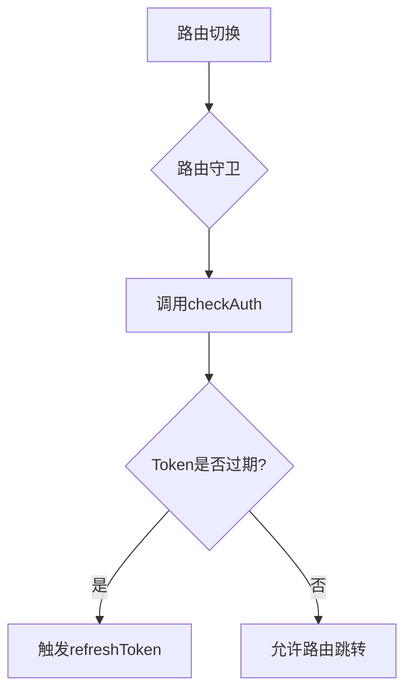
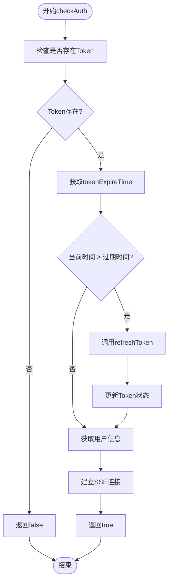
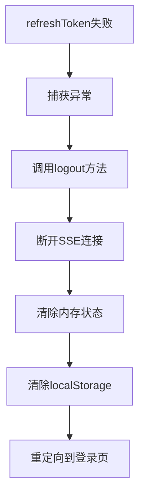

# Token刷新流程

<cite>
**Referenced Files in This Document**   
- [auth.ts](file://src/stores/auth.ts)
- [auth.ts](file://src/services/auth.ts)
- [index.ts](file://src/router/index.ts)
</cite>

## 目录
1. [简介](#简介)
2. [核心机制分析](#核心机制分析)
3. [Token过期检测与刷新流程](#token过期检测与刷新流程)
4. [异常处理机制](#异常处理机制)
5. [完整时序图](#完整时序图)
6. [用户会话连续性保障](#用户会话连续性保障)

## 简介
本文档全面解析专利服务平台中的Token自动刷新机制。该机制通过在每次路由切换或页面加载时自动检查Token状态，确保用户会话的连续性和安全性。文档详细说明了`checkAuth`方法如何检测Token过期并触发刷新流程，以及`refreshToken`方法如何调用后端接口获取新Token、更新内存状态和本地存储。同时，文档还解释了刷新失败时的异常处理逻辑，并通过时序图展示从Token过期检测到刷新完成的完整流程。

## 核心机制分析

### 认证状态管理
系统使用Pinia状态管理库中的`useAuthStore`来集中管理用户认证状态，包括Token、用户信息和加载状态等关键数据。

**Section sources**
- [auth.ts](file://src/stores/auth.ts#L7-L261)

### 路由守卫集成
Token刷新机制与Vue Router的路由守卫深度集成，在每次路由切换时自动触发认证检查。



**Diagram sources**
- [index.ts](file://src/router/index.ts#L150-L280)

## Token过期检测与刷新流程

### 检测机制
`checkAuth`方法在每次路由切换时被调用，首先检查是否存在Token，然后通过比较当前时间与存储在localStorage中的`tokenExpireTime`来判断Token是否过期。



**Diagram sources**
- [auth.ts](file://src/stores/auth.ts#L178-L210)

**Section sources**
- [auth.ts](file://src/stores/auth.ts#L178-L210)

### 刷新流程
当检测到Token过期时，`refreshToken`方法被调用，该方法执行以下操作：
1. 调用`authService.refreshToken()`接口获取新Token
2. 更新内存中的Token状态
3. 将新Token保存到localStorage
4. 重置新的过期时间

```mermaid
sequenceDiagram
participant Store as AuthStore
participant Service as AuthService
participant API as 后端API
participant Storage as localStorage
Store->>Store : checkAuth()
Store->>Store : 获取tokenExpireTime
Store->>Store : 检查Token是否过期
alt Token已过期
Store->>Service : refreshToken()
Service->>API : 调用刷新接口
API-->>Service : 返回新Token和过期时间
Service-->>Store : 返回刷新结果
Store->>Store : 更新内存Token
Store->>Storage : 更新localStorage
Store->>Store : 重置tokenExpireTime
end
Store->>Store : 获取最新用户信息
Store->>Store : 建立SSE连接
Store-->> : 返回认证结果
```

**Diagram sources**
- [auth.ts](file://src/stores/auth.ts#L134-L149)
- [auth.ts](file://src/services/auth.ts#L157-L166)

**Section sources**
- [auth.ts](file://src/stores/auth.ts#L134-L149)

## 异常处理机制
当Token刷新失败时，系统会执行自动登出操作并清除所有本地数据，确保用户账户安全。



**Diagram sources**
- [auth.ts](file://src/stores/auth.ts#L144-L148)

**Section sources**
- [auth.ts](file://src/stores/auth.ts#L144-L148)

## 完整时序图
以下时序图展示了从路由切换开始到Token刷新完成的完整流程：

```mermaid
sequenceDiagram
participant Router as 路由守卫
participant Store as AuthStore
participant Service as AuthService
participant API as 后端API
participant Storage as localStorage
participant SSE as SSE服务
Router->>Store : 调用checkAuth()
Store->>Storage : 读取tokenExpireTime
Store->>Store : 检查Token是否过期
alt Token已过期
Store->>Service : 调用refreshToken()
Service->>API : 发送刷新请求
API-->>Service : 返回新Token和过期时间
Service-->>Store : 返回刷新结果
Store->>Store : 更新内存中的token
Store->>Storage : 更新localStorage中的token
Store->>Storage : 更新tokenExpireTime
end
opt 需要获取用户信息
Store->>Service : 调用getUserInfo()
Service->>API : 发送获取用户信息请求
API-->>Service : 返回用户信息
Service-->>Store : 返回用户信息
Store->>Store : 更新内存中的用户信息
Store->>Storage : 更新localStorage中的用户信息
end
opt 需要建立SSE连接
Store->>SSE : 调用connect(userId)
SSE-->> : 建立SSE连接
end
Store-->>Router : 返回认证结果
Router->>Router : 允许路由跳转
```

**Diagram sources**
- [auth.ts](file://src/stores/auth.ts#L178-L210)
- [auth.ts](file://src/services/auth.ts#L157-L166)
- [index.ts](file://src/router/index.ts#L150-L280)

## 用户会话连续性保障
Token自动刷新机制通过以下方式保障用户会话的连续性：

1. **无感刷新**：在用户无感知的情况下自动完成Token刷新，避免频繁重新登录
2. **前置检测**：在路由切换时提前检测Token状态，确保后续请求的合法性
3. **状态同步**：同时更新内存状态和本地存储，保持数据一致性
4. **异常恢复**：刷新失败时自动清理状态并引导用户重新登录，防止状态混乱

该机制有效平衡了安全性与用户体验，既保证了Token的安全性（通过定期刷新），又避免了因Token过期导致的用户体验中断。

**Section sources**
- [auth.ts](file://src/stores/auth.ts#L178-L210)
- [auth.ts](file://src/stores/auth.ts#L134-L149)
- [index.ts](file://src/router/index.ts#L150-L280)