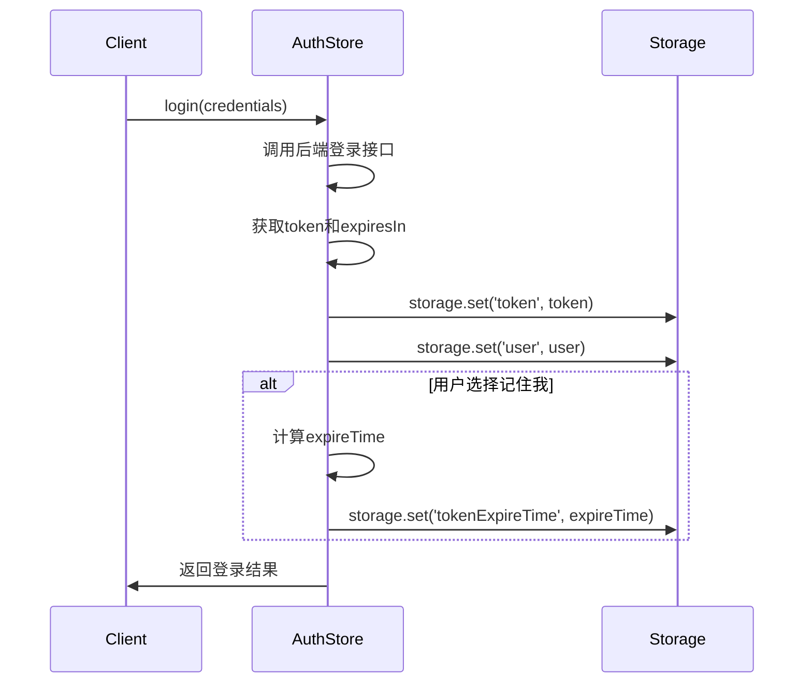

# Token存储机制

<cite>
**Referenced Files in This Document**  
- [auth.ts](file://src/stores/auth.ts)
- [index.ts](file://src/utils/index.ts)
- [TOKEN_FIX.md](file://TOKEN_FIX.md)
</cite>

## 目录
1. [简介](#简介)
2. [核心存储流程](#核心存储流程)
3. [storage工具类实现原理](#storage工具类实现原理)
4. [tokenExpireTime存储策略](#tokenexpiretime存储策略)
5. [登录流程中的完整存储示例](#登录流程中的完整存储示例)
6. [最佳实践建议](#最佳实践建议)

## 简介
本文档详细阐述了JWT token在浏览器中的存储实现机制，重点分析了`src/stores/auth.ts`中如何通过`storage.set()`将token和用户信息持久化到localStorage，以及`src/utils/index.ts`中storage工具类的实现原理。特别说明了因使用`JSON.stringify()`序列化导致字符串token被添加双引号的问题，以及`tokenExpireTime`的存储策略在自动刷新中的作用。

## 核心存储流程
系统采用Pinia状态管理库结合自定义storage工具类实现token的持久化存储。当用户登录成功后，系统会将JWT token和用户信息同时保存在内存状态和浏览器localStorage中，确保页面刷新后仍能保持登录状态。

**Section sources**
- [auth.ts](file://src/stores/auth.ts#L34-L57)

## storage工具类实现原理
`storage`工具类位于`src/utils/index.ts`，提供了一套封装的本地存储接口。其核心实现原理如下：

- `get(key, defaultValue)`：通过`localStorage.getItem()`获取值，并使用`JSON.parse()`尝试解析JSON字符串
- `set(key, value)`：使用`JSON.stringify(value)`序列化所有值后存储
- `remove(key)`：移除指定键的存储项
- `clear()`：清空所有存储

该实现存在一个关键问题：对字符串类型的token也进行`JSON.stringify()`处理，导致原始token字符串被转换为JSON字符串格式（即添加了双引号）。例如，原始token `abc123`会被存储为 `"abc123"`。

为解决此问题，系统在HTTP拦截器中采用了兼容性读取策略：先尝试`JSON.parse()`解析，若失败则直接使用原始值。

```mermaid
flowchart TD
A["storage.set('token', 'abc123')"] --> B["JSON.stringify('abc123')"]
B --> C["\"abc123\""]
C --> D["localStorage.setItem('token', '\"abc123\"')"]
D --> E["存储结果: \"abc123\""]
E --> F["读取时需JSON.parse()处理"]
```

**Diagram sources**
- [index.ts](file://src/utils/index.ts#L250-L270)
- [TOKEN_FIX.md](file://TOKEN_FIX.md#L49-L68)

**Section sources**
- [index.ts](file://src/utils/index.ts#L250-L270)

## tokenExpireTime存储策略
`tokenExpireTime`用于记录token的过期时间戳，支持自动刷新功能。其存储策略如下：

- 当用户登录且选择"记住我"时，系统会计算并存储token的过期时间
- 过期时间 = 当前时间 + token有效期（从后端获取的expiresIn）
- 在每次请求前，系统会检查当前时间是否超过`tokenExpireTime`，若超过则自动触发刷新流程
- 登出时会清除`tokenExpireTime`

该策略确保了用户体验的连续性，避免了因token过期导致的强制重新登录。



**Diagram sources**
- [auth.ts](file://src/stores/auth.ts#L45-L47)
- [auth.ts](file://src/stores/auth.ts#L185-L187)

**Section sources**
- [auth.ts](file://src/stores/auth.ts#L45-L47)
- [auth.ts](file://src/stores/auth.ts#L185-L187)

## 登录流程中的完整存储示例
以下是登录成功后token和用户信息的完整存储流程：

1. 用户提交登录表单（包含用户名、密码、验证码等）
2. 调用`useAuthStore.login()`方法
3. 成功获取响应后：
   - 更新内存中的token和user状态
   - 调用`storage.set('token', response.token)`持久化存储token
   - 调用`storage.set('user', response.user)`持久化存储用户信息
   - 若选择"记住我"，计算并存储`tokenExpireTime`
4. 获取用户详细信息并建立SSE连接
5. 返回登录结果

此流程确保了数据在内存和持久化存储之间的一致性。

**Section sources**
- [auth.ts](file://src/stores/auth.ts#L34-L57)

## 最佳实践建议
为确保系统的稳定性和可维护性，建议遵循以下最佳实践：

1. **统一使用storage工具**：所有本地存储操作都应通过`storage`工具类进行，避免直接调用`localStorage`原生API
2. **处理数据类型一致性**：注意`JSON.stringify()`对字符串类型的影响，读取时需考虑兼容性
3. **及时清理过期数据**：在登出或token失效时，应清除所有相关存储项
4. **安全考虑**：敏感信息不应长期存储在localStorage中，应结合HttpOnly cookie等更安全的机制
5. **错误处理**：存储操作应包含try-catch块，防止因存储空间不足等问题导致应用崩溃

**Section sources**
- [auth.ts](file://src/stores/auth.ts#L129-L131)
- [index.ts](file://src/utils/index.ts#L250-L270)