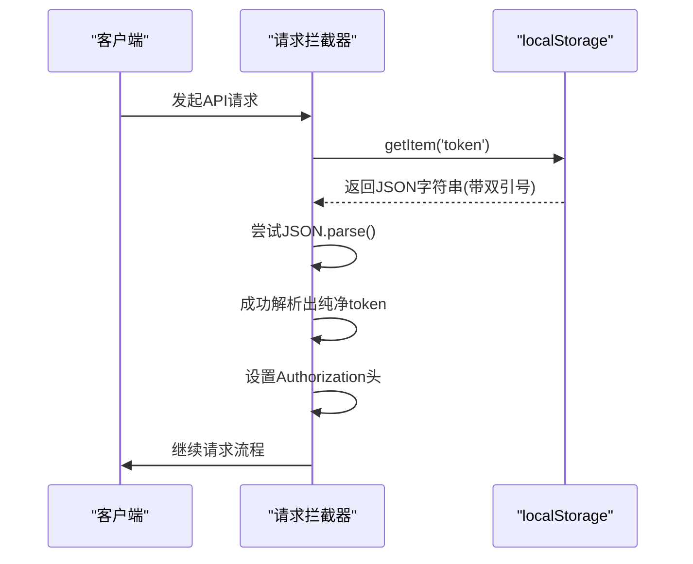
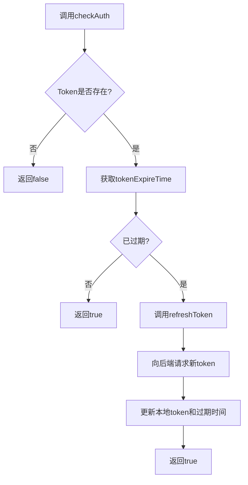

# Token管理机制

<cite>
**Referenced Files in This Document**  
- [src/stores/auth.ts](file://src/stores/auth.ts)
- [src/services/http.ts](file://src/services/http.ts)
- [TOKEN_FIX.md](file://TOKEN_FIX.md)
- [src/utils/index.ts](file://src/utils/index.ts)
</cite>

## 目录
1. [Token存储机制](#token存储机制)
2. [Token读取与双引号问题](#token读取与双引号问题)
3. [Token刷新流程](#token刷新流程)
4. [最佳实践与统一管理](#最佳实践与统一管理)

## Token存储机制

在用户登录成功后，系统通过 `storage.set()` 方法将JWT token及其过期时间持久化存储到浏览器的 `localStorage` 中。该机制主要在 `src/stores/auth.ts` 文件中的 `useAuthStore` Pinia store 内实现。

当用户完成登录流程时，`login` 方法会接收认证响应，并将返回的token和用户信息分别存储到 `token` 和 `user` 状态变量中。随后，通过 `storage.set('token', response.token)` 将token写入本地存储。如果用户选择了"记住我"选项，系统还会计算并存储token的过期时间戳，使用 `storage.set('tokenExpireTime', expireTime)` 进行保存，以便后续进行过期检查。

**Section sources**
- [src/stores/auth.ts](file://src/stores/auth.ts#L60-L85)
- [src/stores/auth.ts](file://src/stores/auth.ts#L145-L155)

## Token读取与双引号问题

### 问题根源

根据 `TOKEN_FIX.md` 文档描述，系统曾面临一个关键问题：Authorization 请求头中的 token 值错误地包含了双引号，导致后端认证失败并返回401错误。此问题的根本原因在于存储与读取方式的不匹配：

- **存储方式**：`storage.set()` 方法内部使用 `JSON.stringify()` 对值进行序列化。当存储字符串类型的token时，会被转换为JSON字符串格式（例如：`"eyJhbGciOiJIUzI1NiIsInR5cCI6..."`），即在原始token值的两端添加了双引号。
- **读取方式**：如果直接使用 `localStorage.getItem('token')` 读取，获取到的是包含双引号的JSON字符串，而非纯净的token值。

### 解决方案

为解决此问题，系统在 `src/services/http.ts` 的请求拦截器中实现了安全的解析机制。当从 `localStorage` 获取token字符串后，代码会尝试使用 `JSON.parse()` 进行解析：

```typescript
const tokenStr = localStorage.getItem('token')
let token: string | null = null
if (tokenStr) {
  try {
    token = JSON.parse(tokenStr) // 尝试解析JSON格式
  } catch {
    token = tokenStr // 解析失败则使用原始值
  }
}
```

这种双重处理策略确保了无论token是以JSON字符串格式存储还是以原始字符串格式存储，都能正确提取出不包含双引号的纯净token值，并将其设置到HTTP请求的 `Authorization` 头中。

**Diagram sources**
- [src/services/http.ts](file://src/services/http.ts#L25-L50)
- [TOKEN_FIX.md](file://TOKEN_FIX.md#L1-L123)
- [src/utils/index.ts](file://src/utils/index.ts#L250-L270)



**Section sources**
- [src/services/http.ts](file://src/services/http.ts#L25-L60)
- [TOKEN_FIX.md](file://TOKEN_FIX.md#L1-L123)

## Token刷新流程

系统的token自动刷新机制由 `checkAuth` 方法驱动，该方法在应用初始化和需要验证用户身份时被调用。刷新流程的触发条件是：当前token存在且其过期时间戳（`tokenExpireTime`）小于当前时间戳。

具体流程如下：
1. 调用 `storage.get<number>('tokenExpireTime')` 获取存储的过期时间。
2. 比较当前时间与过期时间，若已过期，则自动调用 `refreshToken()` 方法。
3. `refreshToken()` 会向后端发起刷新请求，获取新的token。
4. 将新获取的token和更新后的过期时间通过 `storage.set()` 重新存储。

此机制确保了用户在token过期前能够无缝获得新的有效token，提升了用户体验，避免了频繁的重新登录。

**Diagram sources**
- [src/stores/auth.ts](file://src/stores/auth.ts#L178-L210)
- [src/stores/auth.ts](file://src/stores/auth.ts#L157-L167)



**Section sources**
- [src/stores/auth.ts](file://src/stores/auth.ts#L178-L210)

## 最佳实践与统一管理

为确保token管理的一致性和安全性，系统推荐采用统一的 `storage` 工具进行所有存取操作。`storage` 工具封装了 `localStorage` 的 `getItem` 和 `setItem` 方法，并自动处理JSON序列化与反序列化。

最佳实践包括：
- **统一存取**：始终使用 `storage.set()` 存储和 `storage.get()` 读取，避免直接操作 `localStorage`。
- **类型安全**：在调用 `storage.get()` 时指定泛型类型（如 `storage.get<string>('token')`），以确保类型正确。
- **错误处理**：`storage` 工具内部包含try-catch块，能优雅处理序列化/反序列化过程中的错误。

通过遵循这些实践，可以有效避免因存储格式不一致导致的问题，并提高代码的可维护性。

**Section sources**
- [src/utils/index.ts](file://src/utils/index.ts#L250-L270)
- [src/stores/auth.ts](file://src/stores/auth.ts#L10-L15)