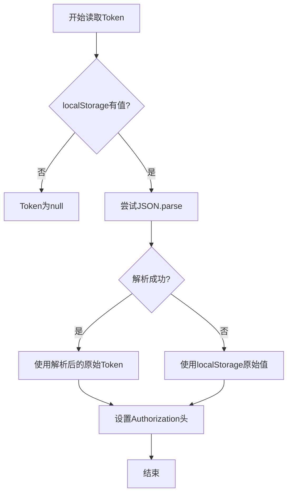
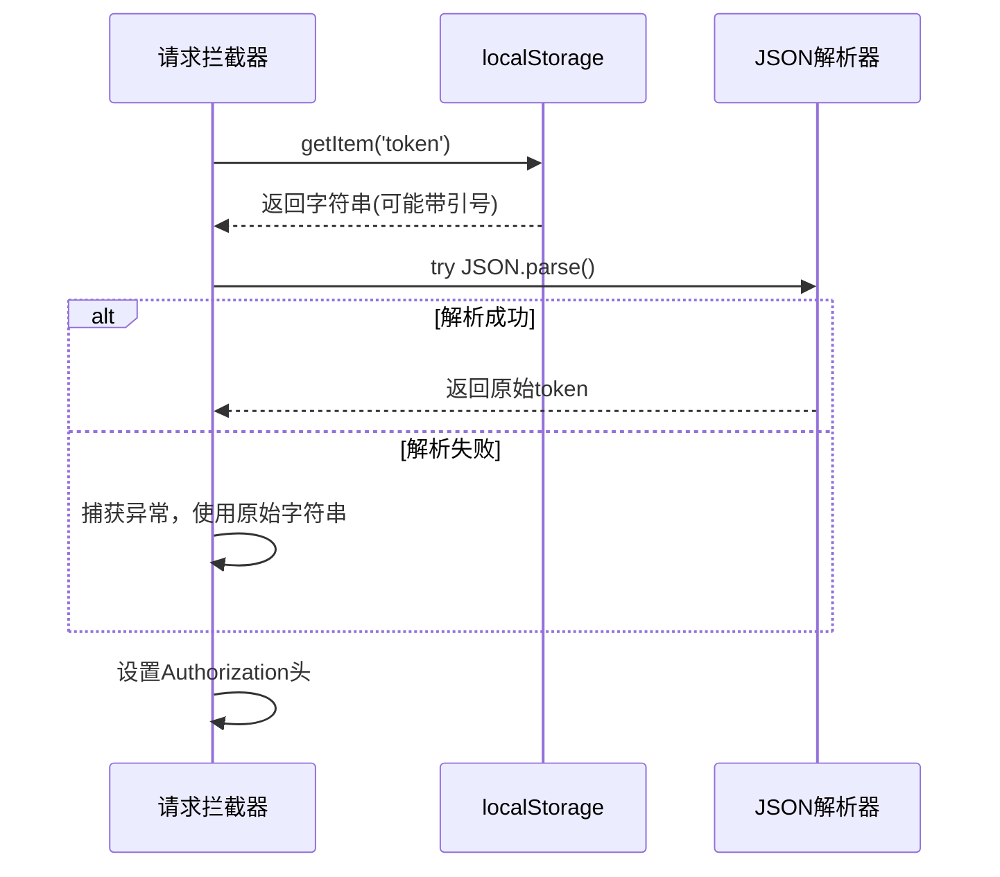

# Token解析方案

<cite>
**Referenced Files in This Document**   
- [TOKEN_FIX.md](file://TOKEN_FIX.md)
- [src/services/http.ts](file://src/services/http.ts)
- [src/utils/index.ts](file://src/utils/index.ts)
- [src/views/tech-report/TechReportNewView.vue](file://src/views/tech-report/TechReportNewView.vue)
</cite>

## 目录
1. [问题背景](#问题背景)
2. [根本原因分析](#根本原因分析)
3. [解决方案详解](#解决方案详解)
4. [核心代码实现](#核心代码实现)
5. [技术方案权衡](#技术方案权衡)
6. [调试与验证方法](#调试与验证方法)
7. [最佳实践与预防措施](#最佳实践与预防措施)

## 问题背景

在专利服务网站的开发过程中，发现用户在执行需要认证的API请求时，频繁遭遇401未授权错误。经过排查，问题根源定位在HTTP请求头`Authorization`中携带的JWT（JSON Web Token）被错误地包裹了双引号，导致后端服务无法正确解析该令牌，从而拒绝了所有请求。此问题严重影响了用户的核心功能，如技术报告生成、专利检索等。

## 根本原因分析

该问题的根本原因在于**存储与读取机制的不匹配**，具体表现为：

1.  **存储端行为**：项目中定义的全局`storage`工具类（位于`src/utils/index.ts`）在存储数据时，统一使用`JSON.stringify()`方法。
    ```typescript
    // src/utils/index.ts
    set(key: string, value: any): void {
      localStorage.setItem(key, JSON.stringify(value))
    }
    ```
    当一个原始的token字符串（如 `eyJhbGciOiJIUzI1NiIsInR5cCI6...`）通过`storage.set('token', token)`存储时，它会被序列化为一个JSON字符串，即在原始字符串的两端加上双引号，存储在`localStorage`中的实际值为 `"eyJhbGciOiJIUzI1NiIsInR5cCI6..."`。

2.  **读取端行为**：在修复前，HTTP请求拦截器（位于`src/services/http.ts`）直接使用`localStorage.getItem('token')`读取token。由于`getItem`返回的是`localStorage`中存储的原始字符串，因此获取到的是一个**带双引号的JSON字符串**，而非原始的token。

3.  **最终结果**：当这个带双引号的字符串被直接设置到`Authorization`请求头时，请求头的值变成了`"Bearer \"eyJhbGciOiJIUzI1NiIsInR5cCI6...\""`（或类似格式），后端服务在解析时会将整个带引号的字符串视为无效的token，从而返回401错误。

**Section sources**
- [TOKEN_FIX.md](file://TOKEN_FIX.md#L1-L50)
- [src/utils/index.ts](file://src/utils/index.ts#L250-L270)

## 解决方案详解

为解决此问题，团队评估了两种方案，并最终采用了**修改读取端**的策略。

### 方案一：修改读取端（已采用）

该方案的核心思想是**增强读取逻辑的健壮性**，使其能够兼容两种存储格式：由`storage.set()`产生的JSON字符串和直接存储的原始字符串。



**Diagram sources**
- [src/services/http.ts](file://src/services/http.ts#L20-L40)

### 方案二：修改存储端（备选）

该方案建议修改`storage.set()`方法，对字符串类型的数据不进行`JSON.stringify()`处理。虽然这能从根本上统一格式，但存在以下风险：
- **破坏性变更**：项目中可能已有其他数据（如对象、数组）依赖`storage.set()`的序列化功能，修改后可能导致这些数据读取异常。
- **维护成本高**：需要全局审查所有`storage.set()`的调用，确保不会引入新的bug。

最终，团队选择了**方案一**，因为它：
- **风险低**：只影响token的读取，不改变任何存储行为。
- **兼容性强**：能够无缝处理历史数据和新数据。
- **易于实现和回滚**：代码改动集中且简单。

## 核心代码实现

### HTTP请求拦截器中的Token解析

在`src/services/http.ts`的请求拦截器中，实现了关键的try-catch解析逻辑。



**Diagram sources**
- [src/services/http.ts](file://src/services/http.ts#L20-L50)

**Section sources**
- [src/services/http.ts](file://src/services/http.ts#L20-L50)

### 其他受影响的代码点

除了主HTTP服务，`TOKEN_FIX.md`文档还指出`TechReportNewView.vue`组件中的`generateReport`方法也存在同样的问题。该方法在调用API前也直接读取`localStorage`，因此也应用了相同的try-catch解析逻辑以确保认证成功。

**Section sources**
- [src/views/tech-report/TechReportNewView.vue](file://src/views/tech-report/TechReportNewView.vue#L180-L195)

## 技术方案权衡

| 维度 | 修改读取端 (方案一) | 修改存储端 (方案二) |
| :--- | :--- | :--- |
| **风险等级** | 低 | 高 |
| **影响范围** | 局部 (仅读取逻辑) | 全局 (所有storage调用) |
| **兼容性** | 高 (兼容新旧数据) | 低 (可能破坏现有数据) |
| **实施难度** | 简单 | 复杂 |
| **可维护性** | 高 | 中 |
| **长期收益** | 临时修复 | 根本性解决 |

结论：在项目已上线且存在历史数据的背景下，**方案一**是更安全、更务实的选择。

## 调试与验证方法

为确保修复有效，文档中提供了详细的调试和验证步骤。

### 日志验证

修复后的代码在请求拦截器和`generateReport`方法中都加入了详细的`console.log`调试信息。通过检查浏览器控制台，可以清晰地看到token的处理过程：

```plaintext
=== 请求拦截器调试信息 ===
请求URL: /api/tech-report/generate
localStorage原始值: "eyJhbGciOiJIUzI1NiIsInR5cCI6...
Token是否存在: true
Token长度: 172
Token前30字符: eyJhbGciOiJIUzI1NiIsInR5cCI6Ikp
Authorization头已设置: eyJhbGciOiJIUzI1NiIsInR5cCI6Ikp
=========================
```

**关键对比**：
- `localStorage原始值`: 显示为带双引号的字符串。
- `Token长度`和`Token前30字符`: 显示的是**不带双引号**的原始token，证明`JSON.parse()`已成功执行。

**Section sources**
- [src/services/http.ts](file://src/services/http.ts#L25-L45)
- [src/views/tech-report/TechReportNewView.vue](file://src/views/tech-report/TechReportNewView.vue#L185-L195)

### 手动测试步骤

1.  **清理环境**：在浏览器控制台执行`localStorage.clear()`，清除所有缓存。
2.  **重新登录**：使用测试账号（admin/admin123）登录，此时token会通过`storage.set()`被正确存储（带双引号）。
3.  **触发请求**：尝试生成一份技术报告或访问其他需要认证的页面。
4.  **检查结果**：确认401错误消失，请求成功，并在控制台日志中观察到上述的调试信息。

## 最佳实践与预防措施

为避免未来出现类似问题，应遵循以下最佳实践：

1.  **统一API**：始终成对使用`storage.set()`和`storage.get()`。`storage.get()`内部也使用`JSON.parse()`，能自动处理序列化数据。
    ```typescript
    // 推荐
    storage.set('token', token)
    const token = storage.get<string>('token')
    ```

2.  **类型安全**：在读取token后，进行类型检查，确保其为字符串。
    ```typescript
    if (token && typeof token === 'string') {
      config.headers.Authorization = token
    }
    ```

3.  **文档化**：将此类“坑”记录在`TOKEN_FIX.md`等文档中，作为团队知识库的一部分。

**Section sources**
- [TOKEN_FIX.md](file://TOKEN_FIX.md#L100-L130)