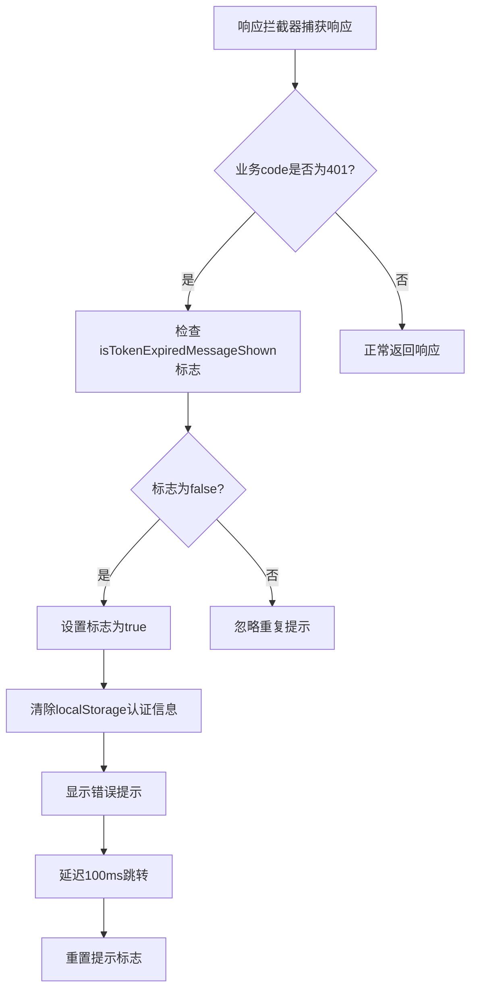
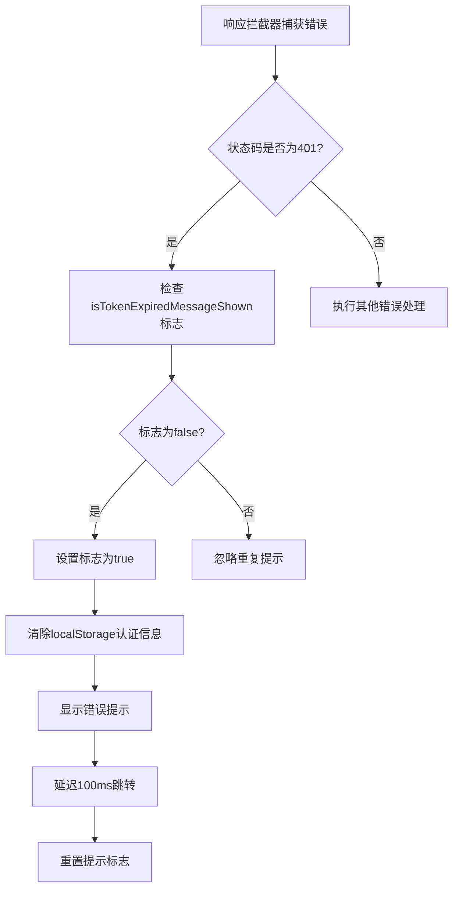
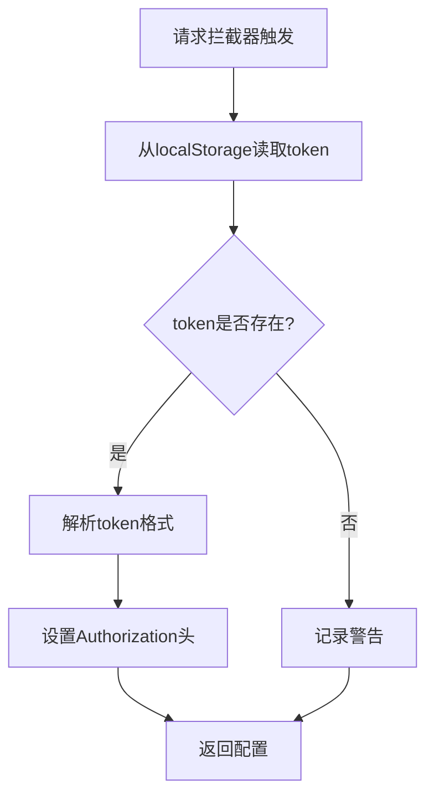
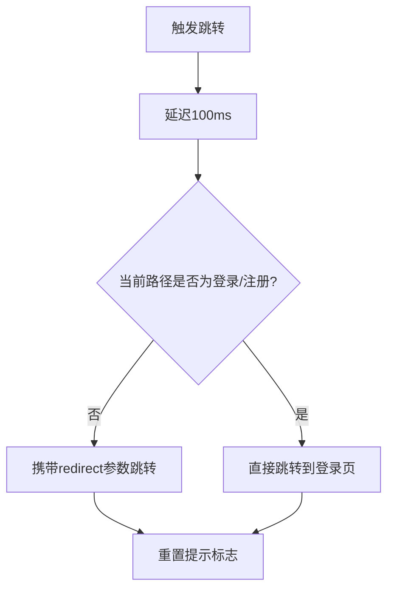
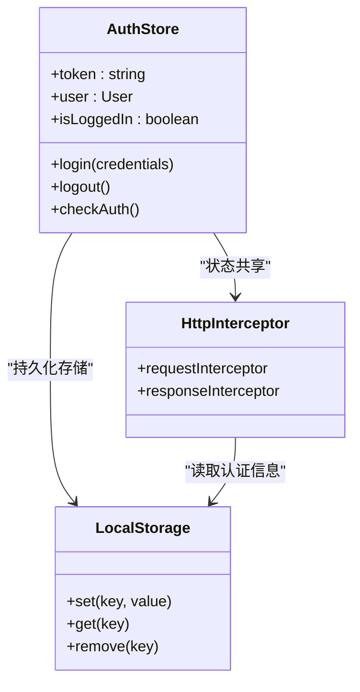
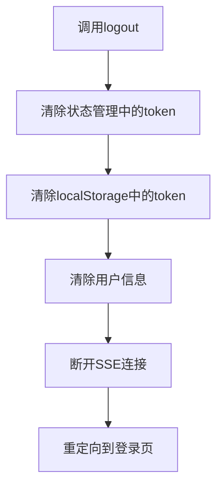

# HTTP拦截器中的会话控制

<cite>
**Referenced Files in This Document**   
- [http.ts](file://src/services/http.ts)
- [auth.ts](file://src/services/auth.ts)
- [LoginView.vue](file://src/views/auth/LoginView.vue)
- [auth.ts](file://src/stores/auth.ts)
</cite>

## 目录
1. [简介](#简介)
2. [核心组件分析](#核心组件分析)
3. [认证失败处理流程](#认证失败处理流程)
4. [请求拦截器实现](#请求拦截器实现)
5. [响应拦截器实现](#响应拦截器实现)
6. [状态管理集成](#状态管理集成)
7. [用户体验优化](#用户体验优化)
8. [结论](#结论)

## 简介
本文档详细分析了专利服务平台中HTTP拦截器的会话控制机制。系统通过Axios拦截器实现了统一的认证管理，特别是在处理401状态码时，采用了一套完整的会话过期处理方案。该方案不仅确保了安全的认证信息清除，还通过精心设计的用户体验流程，实现了从认证失败到重新登录的平滑过渡。

## 核心组件分析

本系统的核心会话控制机制主要由以下几个组件协同工作：

- **HTTP服务** (`src/services/http.ts`)：负责创建Axios实例并配置请求/响应拦截器
- **认证服务** (`src/services/auth.ts`)：提供登录、注册等认证相关API调用
- **认证状态管理** (`src/stores/auth.ts`)：使用Pinia管理用户认证状态
- **登录视图** (`src/views/auth/LoginView.vue`)：用户登录界面及逻辑处理

**Section sources**
- [http.ts](file://src/services/http.ts#L1-L249)
- [auth.ts](file://src/services/auth.ts#L1-L248)
- [LoginView.vue](file://src/views/auth/LoginView.vue#L1-L525)
- [auth.ts](file://src/stores/auth.ts#L1-L263)

## 认证失败处理流程

系统对401认证失败的处理采用了分层防御机制，确保在各种情况下都能正确处理会话过期问题。

### 业务Code 401处理

当后端返回的业务响应中`code`字段为401时，系统会触发会话过期处理流程：



### HTTP状态码401处理

当HTTP响应状态码为401时，系统同样会触发相同的处理流程：



**Diagram sources**
- [http.ts](file://src/services/http.ts#L100-L180)

**Section sources**
- [http.ts](file://src/services/http.ts#L100-L180)

## 请求拦截器实现

请求拦截器负责在每个请求发出前注入认证信息，确保请求的合法性。

### Authorization头注入

请求拦截器从localStorage中读取token，并将其注入到请求头中：



**Diagram sources**
- [http.ts](file://src/services/http.ts#L40-L80)

### Token格式处理

系统支持两种token存储格式，确保兼容性：

- **原始字符串格式**：直接存储的token字符串
- **JSON字符串格式**：通过storage.set方法存储的JSON格式

拦截器会自动检测并解析正确的格式，保证token的正确使用。

**Section sources**
- [http.ts](file://src/services/http.ts#L45-L60)

## 响应拦截器实现

响应拦截器是会话控制的核心，负责统一处理认证失败场景。

### 防重复提示机制

系统使用`isTokenExpiredMessageShown`标志位防止重复提示：

```typescript
let isTokenExpiredMessageShown = false
```

该标志位的作用包括：
- 防止多个并发请求同时触发时重复弹出消息
- 确保用户只收到一次会话过期提示
- 在跳转后重置，允许下次提示

### 认证信息清除

当检测到会话过期时，系统会清除所有本地存储的认证信息：

```javascript
localStorage.removeItem('token')
localStorage.removeItem('user')
localStorage.removeItem('tokenExpireTime')
```

这种全面的清除策略确保了：
- 完全退出当前会话
- 防止残留信息导致的安全问题
- 为重新登录准备干净的环境

### 跳转逻辑实现

系统采用延迟跳转策略，确保用户体验：



**Diagram sources**
- [http.ts](file://src/services/http.ts#L130-L170)

**Section sources**
- [http.ts](file://src/services/http.ts#L130-L170)

## 状态管理集成

会话控制机制与Pinia状态管理紧密集成，确保状态的一致性。

### 认证状态同步

当用户登录时，认证状态会被同步到多个位置：



**Diagram sources**
- [auth.ts](file://src/stores/auth.ts#L10-L50)
- [http.ts](file://src/services/http.ts#L40-L60)

### 登出流程

登出操作会触发一系列清理动作：



**Section sources**
- [auth.ts](file://src/stores/auth.ts#L200-L230)

## 用户体验优化

系统在会话控制方面进行了多项用户体验优化。

### 消息提示

使用Element Plus的ElMessage组件显示会话过期提示：

```javascript
ElMessage({
  type: 'error',
  message: '登录已过期，请重新登录',
  duration: 2000,
  showClose: true
})
```

特点包括：
- 红色错误样式，明确提示问题严重性
- 2秒自动消失，不阻塞用户操作
- 显示关闭按钮，用户可手动关闭

### 重定向保留

跳转时保留当前路径作为redirect参数，实现登录后自动返回原页面：

```javascript
const currentPath = window.location.pathname
window.location.href = '/login?redirect=' + encodeURIComponent(currentPath)
```

这一设计确保了：
- 用户不会丢失当前工作上下文
- 提升用户体验的连续性
- 减少用户操作步骤

**Section sources**
- [http.ts](file://src/services/http.ts#L150-L160)

## 结论

专利服务平台的HTTP拦截器会话控制机制设计完善，通过请求/响应拦截器的协同工作，实现了安全、可靠的认证管理。系统采用防重复提示、全面清除认证信息、延迟跳转等策略，确保了在会话过期时能够提供一致且友好的用户体验。与Pinia状态管理的深度集成，保证了认证状态在应用各部分之间的一致性。整体设计既考虑了安全性，又兼顾了用户体验，为平台的稳定运行提供了坚实的基础。