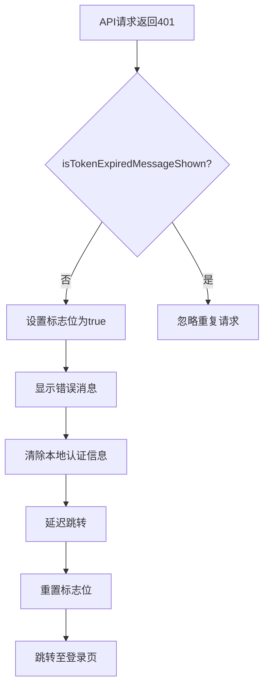
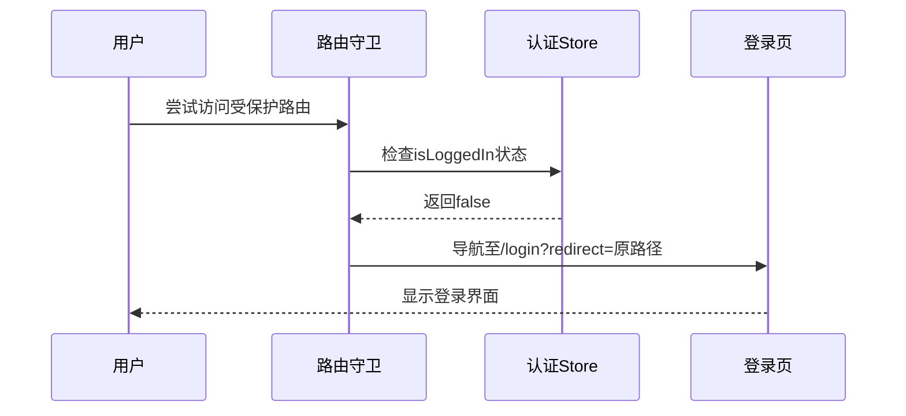

# 会话控制与自动重定向

<cite>
**Referenced Files in This Document**  
- [TOKEN_AUTO_REDIRECT.md](file://TOKEN_AUTO_REDIRECT.md)
- [http.ts](file://src/services/http.ts)
- [index.ts](file://src/router/index.ts)
- [auth.ts](file://src/stores/auth.ts)
</cite>

## 目录
1. [概述](#概述)
2. [HTTP响应拦截器实现](#http响应拦截器实现)
3. [路由守卫机制](#路由守卫机制)
4. [会话控制流程图](#会话控制流程图)
5. [关键组件分析](#关键组件分析)
6. [用户体验流程](#用户体验流程)
7. [安全与最佳实践](#安全与最佳实践)

## 概述

本系统实现了完整的会话控制与自动重定向机制，当用户认证token失效或过期时，系统能够自动清除认证信息并引导用户重新登录。该机制通过HTTP响应拦截器和路由守卫双重保障，确保未授权用户无法访问受保护资源，同时提供良好的用户体验。

系统主要由三个核心组件构成：HTTP服务中的响应拦截器负责捕获API请求的401状态码；路由守卫在页面跳转前进行权限检查；认证Store统一管理用户认证状态。这种分层设计既保证了安全性，又提升了用户体验。

## HTTP响应拦截器实现

HTTP响应拦截器在`src/services/http.ts`文件中实现，是token失效处理的核心组件。当后端API返回401状态码时，拦截器会触发一系列会话控制操作。

拦截器首先检查`isTokenExpiredMessageShown`标志位，防止多个并发请求同时返回401时重复弹出提示消息。该标志位在消息显示后被设置为true，在延迟后重置为false，确保提示的唯一性和可重复性。



**Diagram sources**  
- [http.ts](file://src/services/http.ts#L5-L5)  
- [http.ts](file://src/services/http.ts#L130-L180)

**Section sources**  
- [http.ts](file://src/services/http.ts#L50-L200)

## 路由守卫机制

路由守卫在`src/router/index.ts`文件中定义，作为前端路由的前置检查机制。当用户尝试访问需要认证的路由时，守卫会检查用户的登录状态。

守卫通过`useAuthStore()`获取认证状态，如果`authStore.isLoggedIn`为false且目标路由的`meta.requiresAuth`为true，则中断当前导航，跳转至登录页面并携带原始路径作为redirect参数。这种机制有效防止了未登录用户直接通过URL访问受保护页面。



**Diagram sources**  
- [index.ts](file://src/router/index.ts#L200-L250)  
- [auth.ts](file://src/stores/auth.ts#L10-L20)

**Section sources**  
- [index.ts](file://src/router/index.ts#L200-L290)

## 会话控制流程图

系统会话控制的整体流程涵盖了从token失效检测到重新登录的完整生命周期。该流程确保了系统的安全性和用户体验的连贯性。

```mermaid
graph TD
A[用户操作] --> B[发起API请求]
B --> C{后端验证token}
C --> |有效| D[返回正常响应]
C --> |无效| E[返回401状态码]
E --> F[HTTP拦截器捕获]
F --> G[显示"登录已过期"提示]
G --> H[清除localStorage认证信息]
H --> I[跳转至登录页]
I --> J[用户重新登录]
J --> K[登录成功]
K --> L{是否有redirect参数?}
L --> |有| M[跳转至原页面]
L --> |无| N[跳转至默认首页]
M --> O[恢复用户上下文]
N --> O
```

**Diagram sources**  
- [http.ts](file://src/services/http.ts#L130-L180)  
- [index.ts](file://src/router/index.ts#L200-L250)  
- [auth.ts](file://src/stores/auth.ts#L100-L150)

## 关键组件分析

### 认证信息清除机制

系统在token失效时会彻底清除所有本地认证信息，包括token、用户信息和过期时间戳。这一操作在`src/services/http.ts`的响应拦截器中实现，通过三次`localStorage.removeItem`调用完成。

```typescript
localStorage.removeItem('token')
localStorage.removeItem('user')
localStorage.removeItem('tokenExpireTime')
```

这种全面的清除策略确保了认证信息不会残留在客户端，防止潜在的安全风险。即使后续请求因网络问题未能到达服务器，本地也不会保留无效的认证状态。

**Section sources**  
- [http.ts](file://src/services/http.ts#L82-L84)  
- [http.ts](file://src/services/http.ts#L160-L162)

### 重定向参数处理

系统在跳转至登录页时会携带当前路径作为redirect查询参数，这一设计提升了用户体验。用户登录成功后，系统会读取该参数并跳转回原页面，避免了重新导航的成本。

redirect参数的处理逻辑在`src/router/index.ts`中实现，通过`to.fullPath`获取完整路径，并在登录组件中通过`useRoute().query.redirect`读取。这种标准化的重定向机制确保了流程的一致性和可靠性。

**Section sources**  
- [index.ts](file://src/router/index.ts#L220-L230)  
- [LoginView.vue](file://src/views/auth/LoginView.vue#L50-L70)

## 用户体验流程

### Token使用中过期场景

当用户在系统中操作时token过期，下一个API请求将返回401状态码。此时系统会：
1. 显示"登录已过期，请重新登录"的错误消息
2. 清除本地认证信息
3. 自动跳转至登录页面
4. 保留当前路径作为redirect参数
5. 用户登录成功后自动返回原页面

这一流程确保了用户操作的连续性，即使认证状态失效，也能快速恢复到之前的工作状态。

### 页面刷新时Token失效

当用户刷新页面时，路由守卫会立即检查认证状态。如果token已过期或不存在，守卫会拦截导航，显示"请先登录"提示，并跳转至登录页。这种即时检查机制避免了页面加载后才发现认证失效的问题，提供了更及时的反馈。

### 直接访问受保护页面

未登录用户直接访问受保护路由（如`/app/dashboard`）时，路由守卫会拦截请求，显示登录提示，并将目标路径作为redirect参数传递。用户完成登录后，系统自动跳转至最初请求的页面，实现了无缝的访问体验。

## 安全与最佳实践

### 防重复提示机制

系统通过`isTokenExpiredMessageShown`标志位防止重复提示。当多个并发请求同时返回401时，只有第一个请求会触发消息显示和跳转逻辑，后续请求会被忽略。这避免了用户界面上出现多个重复的错误提示，保持了界面的整洁性。

标志位在跳转延迟后重置，允许用户在重新登录后再次触发该机制。这种设计平衡了防重复和功能可用性，确保机制不会永久失效。

**Section sources**  
- [http.ts](file://src/services/http.ts#L5-L5)  
- [http.ts](file://src/services/http.ts#L130-L140)

### SPA内路由跳转

系统使用`router.push`而非`window.location.href`进行页面跳转。这种方式保持了单页应用（SPA）的特性，避免了整页刷新带来的性能损耗和状态丢失。Vue Router的过渡动画也提供了更流畅的用户体验。

跳转前的延迟（100ms）确保了错误消息能够被用户看到，避免了消息闪现即逝的问题。这种微小的时间控制显著提升了用户对系统状态的理解。

### 完整认证信息管理

系统不仅在HTTP拦截器中清除认证信息，在`src/stores/auth.ts`的`logout`方法中也执行了相同的清除操作。这种多点清除策略确保了无论用户通过何种方式登出（主动登出或token失效），都能彻底清理认证状态，防止信息残留。

认证Store还负责管理SSE（Server-Sent Events）连接，在用户登出时主动断开连接，释放服务器资源。这种全面的状态管理体现了系统设计的完整性。

**Section sources**  
- [auth.ts](file://src/stores/auth.ts#L200-L220)  
- [http.ts](file://src/services/http.ts#L82-L84)