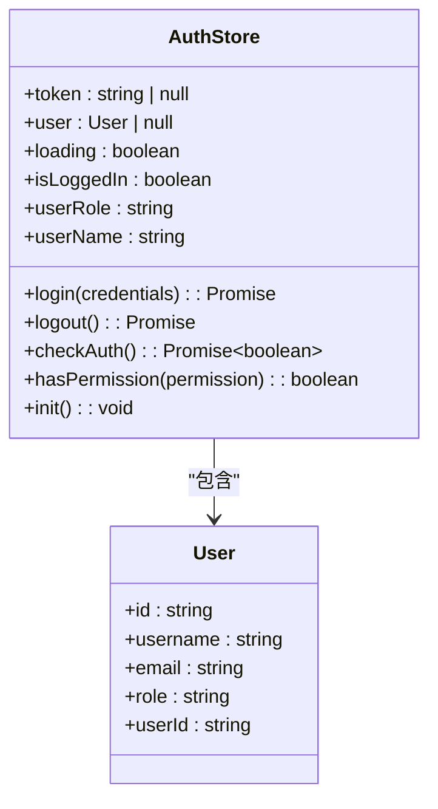
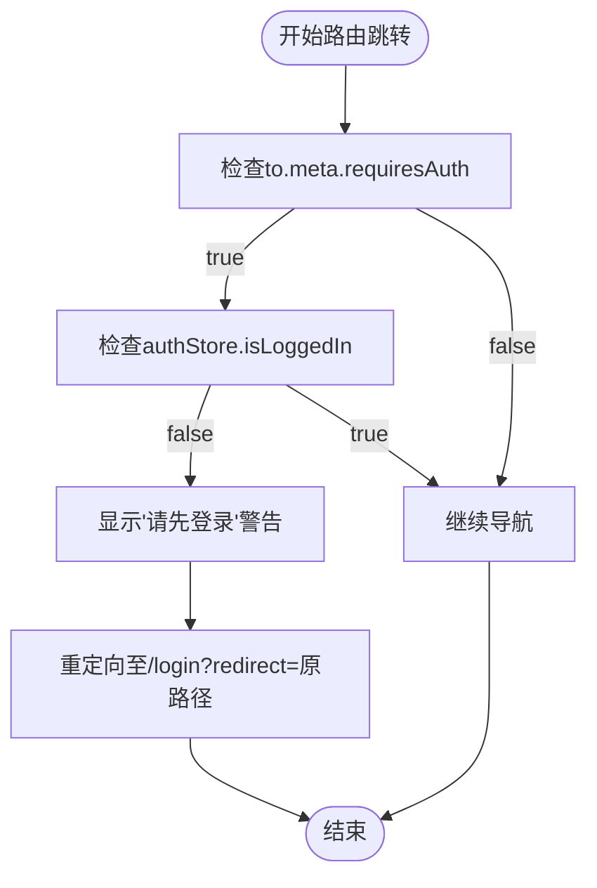
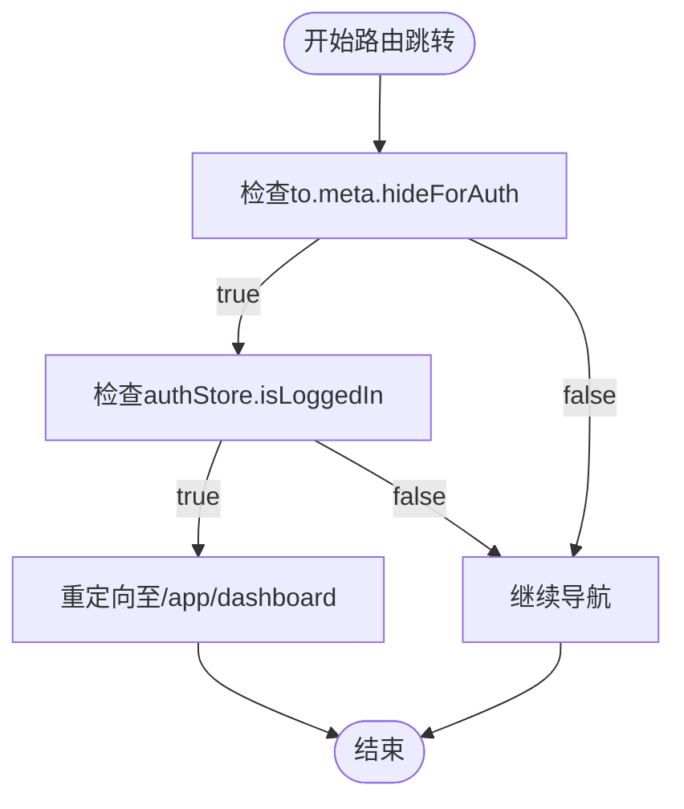
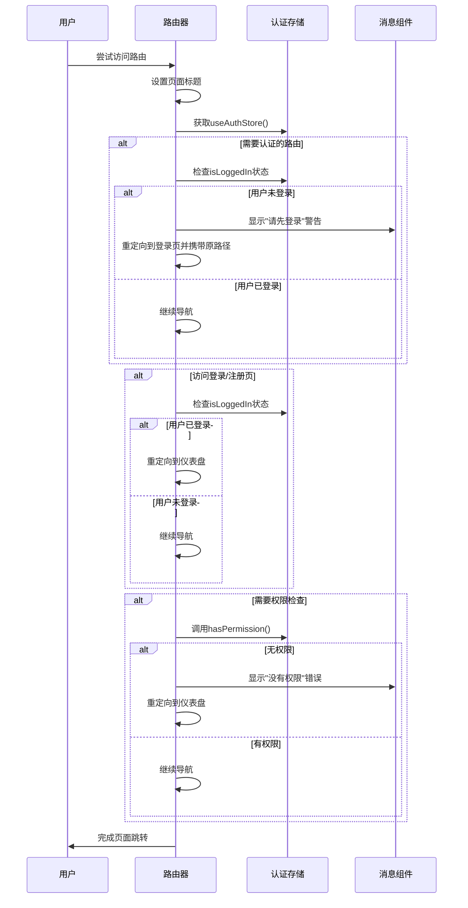

# 路由守卫的认证检查

<cite>
**Referenced Files in This Document**   
- [src/router/index.ts](file://src/router/index.ts)
- [src/stores/auth.ts](file://src/stores/auth.ts)
- [src/views/auth/LoginView.vue](file://src/views/auth/LoginView.vue)
- [src/main.ts](file://src/main.ts)
</cite>

## 目录
1. [引言](#引言)
2. [路由配置结构](#路由配置结构)
3. [认证控制逻辑](#认证控制逻辑)
4. [导航守卫执行流程](#导航守卫执行流程)
5. [权限校验扩展设计](#权限校验扩展设计)
6. [相关组件分析](#相关组件分析)
7. [结论](#结论)

## 引言
本文档深入解析专利服务平台中的路由守卫认证控制机制。重点分析`src/router/index.ts`文件中`router.beforeEach`全局前置守卫的实现逻辑，阐述其如何通过Pinia状态管理实现用户认证状态的检查与访问控制。文档将详细说明认证拦截、页面跳转、消息提示等核心功能的实现方式，并结合路由配置和相关组件，全面展示SPA应用中的导航控制流程。

## 路由配置结构
系统路由采用模块化设计，主要分为公共路由和受保护路由两大类。公共路由包括登录、注册等无需认证的页面，而受保护路由则通过`/app`路径组织，包含仪表盘、技术方案报告、专利检索等核心功能模块。

```mermaid
graph TD
A[/] --> B[/app]
A --> C[/login]
A --> D[/register]
A --> E[/:pathMatch(.*)*]
B --> F[/app/dashboard]
B --> G[/app/tech-report]
B --> H[/app/patent-search]
B --> I[/app/three-analysis]
B --> J[/app/patent-draft]
B --> K[/app/defense-support]
B --> L[/app/profile]
G --> G1[/app/tech-report/new]
G --> G2[/app/tech-report/history]
G --> G3[/app/tech-report/:id]
H --> H1[/app/patent-search/quick]
H --> H2[/app/patent-search/results]
I --> I1[/app/three-analysis/new]
I --> I2[/app/three-analysis/history]
I --> I3[/app/three-analysis/:id]
J --> J1[/app/patent-draft/new]
J --> J2[/app/patent-draft/manage]
J --> J3[/app/patent-draft/edit/:id]
K --> K1[/app/defense-support/simulation]
style C fill:#9f9,stroke:#333
style D fill:#9f9,stroke:#333
style B fill:#f9f,stroke:#333
style F fill:#f9f,stroke:#333
style G fill:#f9f,stroke:#333
style H fill:#f9f,stroke:#333
style I fill:#f9f,stroke:#333
style J fill:#f9f,stroke:#333
style K fill:#f9f,stroke:#333
style L fill:#f9f,stroke:#333
classDef public fill:#9f9,stroke:#333;
classDef protected fill:#f9f,stroke:#333;
class C,D public
class B,F,G,H,I,J,K,L protected
```

**Diagram sources**
- [src/router/index.ts](file://src/router/index.ts#L15-L280)

**Section sources**
- [src/router/index.ts](file://src/router/index.ts#L15-L280)

## 认证控制逻辑
路由守卫的核心功能是实现用户认证状态的检查与访问控制。当用户尝试访问受保护的路由时，系统会自动检查其登录状态，并根据结果执行相应的操作。

### 认证状态获取
系统通过`useAuthStore()`从Pinia中获取全局认证状态。该状态包含用户的登录状态、角色信息、权限等关键数据，为路由守卫提供决策依据。



**Diagram sources**
- [src/stores/auth.ts](file://src/stores/auth.ts#L7-L261)

**Section sources**
- [src/stores/auth.ts](file://src/stores/auth.ts#L7-L261)

### 访问拦截机制
对于需要认证的路由（`meta.requiresAuth = true`），系统会进行登录状态检查。如果用户未登录，将阻止页面访问，显示"请先登录"的警告消息，并重定向到登录页面。



**Diagram sources**
- [src/router/index.ts](file://src/router/index.ts#L240-L250)

**Section sources**
- [src/router/index.ts](file://src/router/index.ts#L240-L250)

### 已登录用户限制
系统还实现了反向控制机制，通过`meta.hideForAuth`属性限制已登录用户访问登录/注册页面。这种设计避免了已认证用户重复登录，提升了用户体验。



**Diagram sources**
- [src/router/index.ts](file://src/router/index.ts#L252-L256)

**Section sources**
- [src/router/index.ts](file://src/router/index.ts#L252-L256)

## 导航守卫执行流程
`router.beforeEach`全局前置守卫在每次路由跳转前执行，是整个SPA应用访问控制的核心。其执行流程严格按照预定义的顺序进行，确保了认证检查的准确性和一致性。



**Diagram sources**
- [src/router/index.ts](file://src/router/index.ts#L238-L268)

**Section sources**
- [src/router/index.ts](file://src/router/index.ts#L238-L268)

## 权限校验扩展设计
系统预留了权限校验的扩展接口，通过`meta.permission`属性支持细粒度的权限控制。虽然当前实现中`hasPermission`方法简单返回true，但其设计为未来实现基于角色或功能的权限系统提供了基础。

```mermaid
classDiagram
class PermissionCheck {
+permission : string
+hasPermission(permission) : boolean
}
class RoleBasedAuth {
+userRole : string
+rolePermissions : Map~string, string[]~
+checkRolePermission(role, permission) : boolean
}
class FeatureFlag {
+featureFlags : Map~string, boolean~
+isFeatureEnabled(feature) : boolean
}
PermissionCheck <|-- RoleBasedAuth
PermissionCheck <|-- FeatureFlag
note right of PermissionCheck
当前系统使用简单的权限检查，
但架构支持扩展为基于角色或
功能开关的复杂权限系统
end note
```

**Diagram sources**
- [src/stores/auth.ts](file://src/stores/auth.ts#L248-L255)

**Section sources**
- [src/stores/auth.ts](file://src/stores/auth.ts#L248-L255)

## 相关组件分析
认证控制机制涉及多个关键组件的协同工作，包括路由配置、状态管理、UI组件等。这些组件共同构成了完整的用户认证体系。

### 主应用初始化
系统在`main.ts`中完成核心组件的初始化和注册，为路由守卫的正常运行提供了必要的环境。

**Section sources**
- [src/main.ts](file://src/main.ts#L1-L23)

### 登录页面实现
登录页面`LoginView.vue`实现了用户认证的前端交互，包括表单验证、验证码处理、登录请求等核心功能。

**Section sources**
- [src/views/auth/LoginView.vue](file://src/views/auth/LoginView.vue#L1-L524)

## 结论
本文档详细解析了专利服务平台的路由守卫认证控制机制。通过`router.beforeEach`全局前置守卫，系统实现了完善的访问控制策略，包括认证检查、权限验证、页面跳转等功能。`useAuthStore()`从Pinia中获取认证状态，为路由守卫提供了决策依据。对于`meta.requiresAuth`为true的路由，系统会检查用户登录状态，未登录时显示警告并重定向到登录页，同时保留原始访问路径。`meta.hideForAuth`机制则防止已登录用户访问登录/注册页面。系统还预留了`meta.permission`权限校验的扩展接口，为未来实现更复杂的权限系统奠定了基础。整个认证控制流程在SPA应用的导航过程中发挥着关键作用，确保了系统的安全性和用户体验。