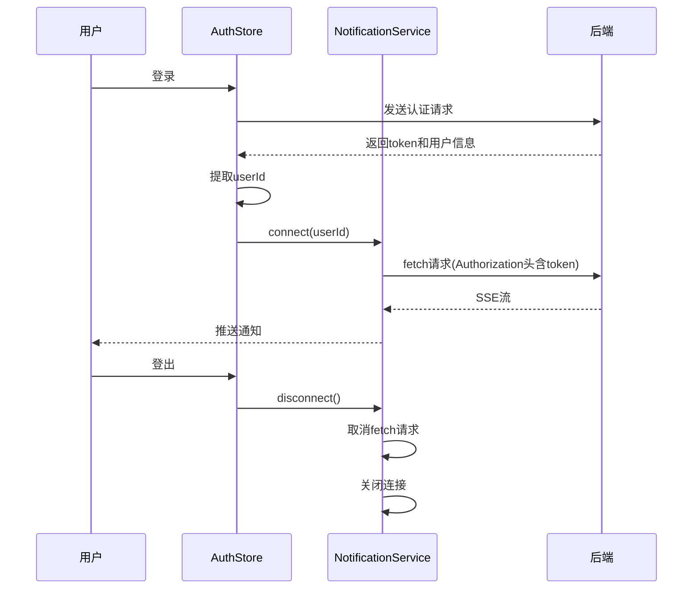

# 安全机制

<cite>
**本文档引用的文件**  
- [auth.ts](file://src/services/auth.ts)
- [auth.ts](file://src/stores/auth.ts)
- [notification.ts](file://src/services/notification.ts)
- [index.ts](file://src/utils/index.ts)
- [http.ts](file://src/services/http.ts)
- [TOKEN_AUTO_REDIRECT.md](file://TOKEN_AUTO_REDIRECT.md)
- [SSE_TOKEN_AUTH_CHANGE.md](file://SSE_TOKEN_AUTH_CHANGE.md)
- [CAPTCHA_FIX.md](file://CAPTCHA_FIX.md)
- [TOKEN_FIX.md](file://TOKEN_FIX.md)
</cite>

## 目录
1. [简介](#简介)
2. [JWT Token 存储与过期管理](#jwt-token-存储与过期管理)
3. [Token 自动刷新机制](#token-自动刷新机制)
4. [Token 失效后自动重定向](#token-失效后自动重定向)
5. [基于用户ID的SSE连接管理](#基于用户id的sse连接管理)
6. [验证码防刷与一致性校验](#验证码防刷与一致性校验)
7. [Token异常处理方案](#token异常处理方案)
8. [安全最佳实践](#安全最佳实践)

## 简介
本系统采用JWT（JSON Web Token）作为核心认证机制，结合localStorage进行客户端状态管理。系统实现了完整的认证安全策略，包括token存储、过期管理、自动刷新、失效处理、SSE连接认证及验证码防护机制。通过多层防护确保用户会话安全，同时提供良好的用户体验。

## JWT Token 存储与过期管理
系统采用localStorage作为JWT token的持久化存储方案，结合tokenExpireTime实现精确的过期时间管理。

### 存储机制
- **存储位置**：`localStorage`中的`token`和`user`字段
- **存储方式**：通过`storage.set()`方法进行序列化存储
- **数据结构**：
  - `token`: JWT字符串
  - `user`: 用户基本信息对象
  - `tokenExpireTime`: token过期时间戳（毫秒）

### 过期时间管理
- **初始设置**：登录成功后根据后端返回的`expiresIn`字段（默认7200秒）计算过期时间
- **存储逻辑**：当用户选择"记住我"时，将过期时间存入`tokenExpireTime`
- **检查机制**：在每次API请求前和路由跳转时检查token有效性

**Section sources**
- [auth.ts](file://src/services/auth.ts#L1-L248)
- [auth.ts](file://src/stores/auth.ts#L1-L263)
- [index.ts](file://src/utils/index.ts#L1-L271)

## Token 自动刷新机制
系统实现了自动token刷新机制，确保用户在token即将过期时能够无缝续期。

### 刷新流程
1. **触发条件**：
   - 路由跳转时`checkAuth`方法检测到token已过期
   - API请求拦截器捕获401错误
2. **刷新过程**：
   - 调用`authService.refreshToken()`接口
   - 更新localStorage中的token和tokenExpireTime
   - 重试失败的API请求
3. **失败处理**：
   - 刷新失败时自动执行登出流程
   - 清除所有认证信息
   - 跳转至登录页

### 实现细节
- **方法调用**：`refreshToken()`方法在`authStore`中实现
- **状态同步**：刷新成功后同步更新store中的token状态
- **错误捕获**：包含完整的错误处理和降级方案

**Section sources**
- [auth.ts](file://src/services/auth.ts#L157-L169)
- [auth.ts](file://src/stores/auth.ts#L134-L146)
- [auth.ts](file://src/stores/auth.ts#L185-L188)

## Token 失效后自动重定向
系统通过多层机制实现token失效后的自动重定向至登录页功能。

### 核心实现
#### HTTP响应拦截器
- **401错误处理**：捕获所有返回401状态码的响应
- **防重复提示**：使用标志位防止多个并发请求触发多次提示
- **清除认证信息**：移除localStorage中的token、user和tokenExpireTime
- **延迟跳转**：500ms延迟确保用户能看到错误提示

#### 路由守卫
- **前置检查**：在路由跳转前检查`authStore.isLoggedIn`状态
- **重定向参数**：保留原路径用于登录后跳转
- **白名单处理**：避免在登录/注册页重复跳转

### 用户体验流程
```mermaid
flowchart TD
A[用户操作] --> B{Token有效?}
B --> |是| C[正常请求]
B --> |否| D[返回401]
D --> E[显示"登录已过期"提示]
E --> F[清除认证信息]
F --> G[跳转至登录页]
G --> H[登录成功]
H --> I[返回原页面]
```

**Diagram sources**
- [TOKEN_AUTO_REDIRECT.md](file://TOKEN_AUTO_REDIRECT.md#L1-L425)
- [http.ts](file://src/services/http.ts#L1-L200)
- [index.ts](file://src/router/index.ts#L1-L100)

**Section sources**
- [TOKEN_AUTO_REDIRECT.md](file://TOKEN_AUTO_REDIRECT.md#L1-L425)
- [http.ts](file://src/services/http.ts#L1-L200)
- [index.ts](file://src/router/index.ts#L1-L100)

## 基于用户ID的SSE连接管理
系统在用户登录后基于userId建立安全的SSE连接，并在登出时安全断开。

### 连接建立流程
1. **登录成功后**：调用`authService.getUserInfo()`获取用户详细信息
2. **获取userId**：从用户信息中提取userId字段
3. **建立连接**：调用`notificationService.connect(userId)`

### 认证方式
- **原方案**：通过URL参数传递token（不安全）
- **新方案**：通过`Authorization`请求头传递token
- **技术实现**：使用fetch API + ReadableStream替代EventSource

### 安全断开
- **登出时**：调用`notificationService.disconnect()`
- **断开方式**：
  - 关闭EventSource连接
  - 通过AbortController取消fetch请求
  - 清除重连定时器



**Diagram sources**
- [SSE_TOKEN_AUTH_CHANGE.md](file://SSE_TOKEN_AUTH_CHANGE.md#L1-L286)
- [auth.ts](file://src/stores/auth.ts#L1-L263)
- [notification.ts](file://src/services/notification.ts#L1-L314)

**Section sources**
- [SSE_TOKEN_AUTH_CHANGE.md](file://SSE_TOKEN_AUTH_CHANGE.md#L1-L286)
- [auth.ts](file://src/stores/auth.ts#L1-L263)
- [notification.ts](file://src/services/notification.ts#L1-L314)

## 验证码防刷与一致性校验
系统实现了验证码的防刷机制和一致性校验措施。

### 防刷机制
- **UUID绑定**：每个验证码关联唯一UUID
- **时效性**：验证码具有较短的有效期
- **单次使用**：验证码使用后立即失效

### 一致性校验
- **Base64前缀处理**：自动为纯Base64字符串添加`data:image/jpeg;base64,`前缀
- **兼容性检查**：检测是否已包含前缀，避免重复添加
- **格式验证**：确保生成的Data URL符合标准格式

### 实现代码
```typescript
const imgData = response.img.startsWith('data:') 
  ? response.img 
  : `data:image/jpeg;base64,${response.img}`
```

**Section sources**
- [CAPTCHA_FIX.md](file://CAPTCHA_FIX.md#L1-L105)
- [auth.ts](file://src/services/auth.ts#L100-L120)

## Token异常处理方案
系统针对token相关的异常情况提供了完整的处理方案。

### 双引号问题修复
- **问题根源**：`JSON.stringify()`导致token被双引号包裹
- **解决方案**：读取时尝试`JSON.parse()`，失败则使用原始值
- **实现位置**：HTTP请求拦截器中

### 处理逻辑
```typescript
let token: string | null = null
if (tokenStr) {
  try {
    token = JSON.parse(tokenStr)
  } catch {
    token = tokenStr
  }
}
```

### 预防措施
- **统一存储读取**：使用`storage.set()`和`storage.get()`配对
- **类型检查**：确保token为字符串类型
- **最佳实践**：直接存储字符串而非JSON序列化

**Section sources**
- [TOKEN_FIX.md](file://TOKEN_FIX.md#L1-L123)
- [http.ts](file://src/services/http.ts#L1-L200)
- [index.ts](file://src/utils/index.ts#L1-L271)

## 安全最佳实践
### 敏感操作重新认证
- 对密码修改、账户删除等敏感操作，要求用户重新输入密码
- 临时提升权限令牌的有效期较短

### Token泄露应对
- **短期应对**：用户可主动登出所有设备
- **长期策略**：定期强制token刷新
- **监控机制**：异常登录行为检测

### 存储安全
- **避免敏感信息**：localStorage中不存储明文密码
- **加密存储**：考虑对token进行额外加密
- **清理策略**：非"记住我"场景下关闭浏览器即清除

### 传输安全
- **HTTPS强制**：所有认证相关请求必须通过HTTPS
- **请求头认证**：token通过Authorization头传输而非URL参数
- **CORS配置**：严格限制跨域访问权限

### 会话管理
- **多设备支持**：允许用户在多设备同时登录
- **会话监控**：提供活跃会话列表供用户管理
- **自动登出**：长时间无操作自动登出

**Section sources**
- [auth.ts](file://src/services/auth.ts#L1-L248)
- [auth.ts](file://src/stores/auth.ts#L1-L263)
- [notification.ts](file://src/services/notification.ts#L1-L314)
- [TOKEN_FIX.md](file://TOKEN_FIX.md#L1-L123)
- [SSE_TOKEN_AUTH_CHANGE.md](file://SSE_TOKEN_AUTH_CHANGE.md#L1-L286)