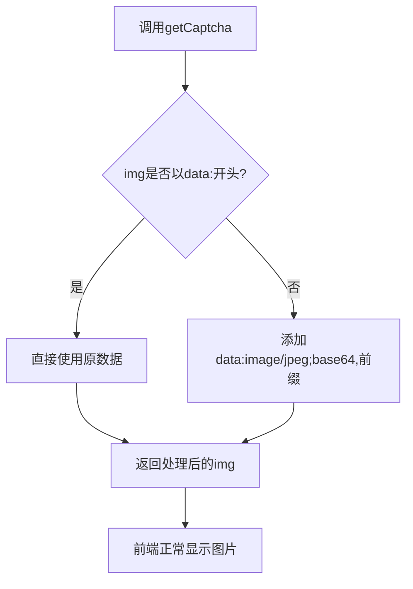
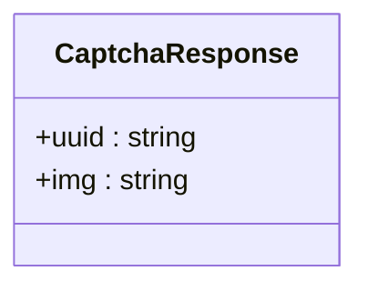
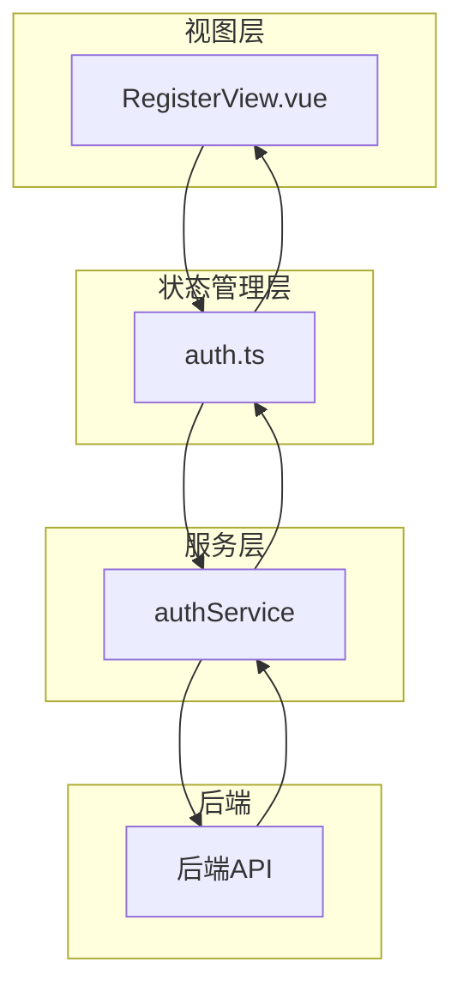
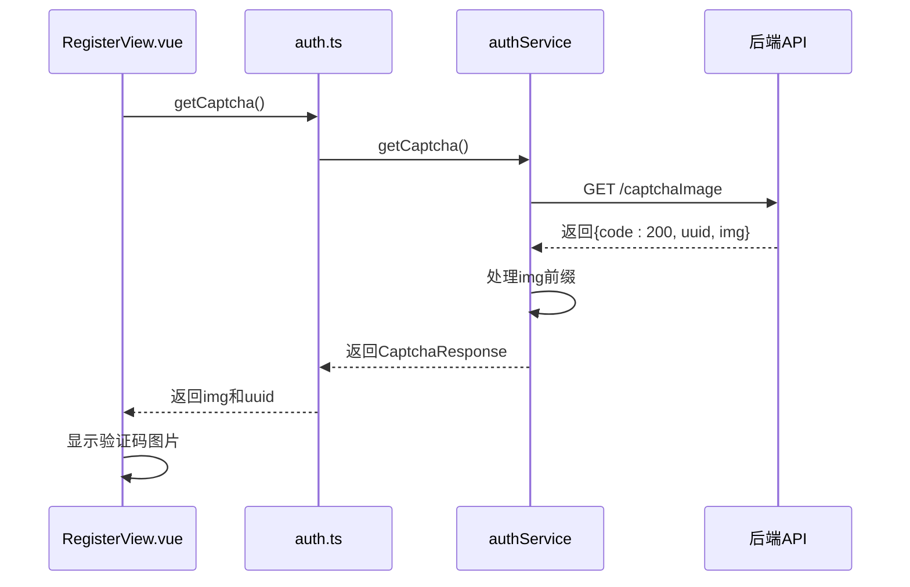
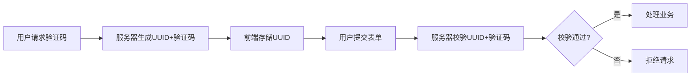

# 验证码安全机制

<cite>
**Referenced Files in This Document**  
- [CAPTCHA_FIX.md](file://CAPTCHA_FIX.md)
- [src/services/auth.ts](file://src/services/auth.ts)
- [src/stores/auth.ts](file://src/stores/auth.ts)
- [src/views/auth/RegisterView.vue](file://src/views/auth/RegisterView.vue)
</cite>

## 目录
1. [引言](#引言)
2. [验证码显示问题与解决方案](#验证码显示问题与解决方案)
3. [核心安全机制分析](#核心安全机制分析)
4. [组件交互流程](#组件交互流程)
5. [一致性校验实现](#一致性校验实现)
6. [防刷策略总结](#防刷策略总结)
7. [结论](#结论)

## 引言
在现代Web应用中，验证码系统是防止自动化攻击和恶意刷取的关键安全屏障。本文基于`CAPTCHA_FIX.md`文档，深入分析本系统中验证码的安全机制，重点阐述前端如何处理后端返回的Base64图片数据，以及通过UUID与验证码绑定实现的一致性校验机制，从而有效防止验证码被重复利用或恶意刷取，全面提升系统的安全性。

## 验证码显示问题与解决方案

### 问题背景
后端返回的验证码数据中，`img`字段为纯Base64编码字符串，不包含标准的`data:image/jpeg;base64,`前缀。这种格式虽然节省了传输体积，但无法被HTML的``标签直接识别和渲染，导致验证码图片无法正常显示。

### 兼容性处理方案
为解决此问题，在`src/services/auth.ts`的`getCaptcha()`方法中实现了智能兼容处理机制：

**Diagram sources**  
- [src/services/auth.ts](file://src/services/auth.ts#L100-L115)

**Section sources**  
- [CAPTCHA_FIX.md](file://CAPTCHA_FIX.md#L1-L50)
- [src/services/auth.ts](file://src/services/auth.ts#L100-L115)

## 核心安全机制分析

### 数据结构定义
系统通过`CaptchaResponse`接口明确定义了验证码响应的数据结构，包含`uuid`和`img`两个核心字段，确保前后端数据交互的类型安全。

**Diagram sources**  
- [src/services/auth.ts](file://src/services/auth.ts#L18-L21)

### 安全增强设计
该机制的设计不仅解决了显示问题，更体现了多重安全考量：
- **格式兼容性**：通过`startsWith('data:')`判断，确保未来若后端升级包含前缀时仍能兼容
- **MIME类型明确**：使用`image/jpeg`明确指定图片类型，避免浏览器解析歧义
- **数据完整性**：保持Base64原始数据不变，仅添加必要前缀，确保图片内容不被篡改

**Section sources**  
- [CAPTCHA_FIX.md](file://CAPTCHA_FIX.md#L51-L80)
- [src/services/auth.ts](file://src/services/auth.ts#L100-L115)

## 组件交互流程

### 整体架构
系统采用分层架构，验证码功能涉及服务层、状态管理层和视图层的协同工作。

**Diagram sources**  
- [src/views/auth/RegisterView.vue](file://src/views/auth/Register/RegisterView.vue#L1-L375)
- [src/stores/auth.ts](file://src/stores/auth.ts#L1-L263)
- [src/services/auth.ts](file://src/services/auth.ts#L1-L248)

### 方法调用链
当用户访问注册页面时，系统自动触发验证码获取流程：

**Diagram sources**  
- [src/views/auth/RegisterView.vue](file://src/views/auth/Register/RegisterView.vue#L150-L170)
- [src/stores/auth.ts](file://src/stores/auth.ts#L130-L140)
- [src/services/auth.ts](file://src/services/auth.ts#L100-L120)

**Section sources**  
- [src/views/auth/RegisterView.vue](file://src/views/auth/Register/RegisterView.vue#L150-L170)
- [src/stores/auth.ts](file://src/stores/auth.ts#L130-L140)

## 一致性校验实现

### UUID绑定机制
系统通过将验证码`code`与唯一标识`uuid`进行绑定，实现了请求级别的一致性校验。每次获取验证码时，服务器生成新的UUID，确保每个验证码只能使用一次。

### 防重放攻击
该机制有效防止了以下安全威胁：
- **验证码复用**：旧的验证码无法通过新的UUID校验
- **批量刷取**：攻击者无法通过固定UUID批量获取验证码
- **中间人攻击**：即使截获验证码，也无法在其他会话中使用

**Diagram sources**  
- [src/services/auth.ts](file://src/services/auth.ts#L100-L120)
- [src/stores/auth.ts](file://src/stores/auth.ts#L130-L140)
- [src/views/auth/RegisterView.vue](file://src/views/auth/Register/RegisterView.vue#L150-L170)

**Section sources**  
- [src/services/auth.ts](file://src/services/auth.ts#L100-L120)
- [src/views/auth/RegisterView.vue](file://src/views/auth/Register/RegisterView.vue#L150-L170)

## 防刷策略总结
本系统通过多层次的安全设计构建了完整的防刷体系：

| 安全措施 | 实现方式 | 防护目标 |
|---------|--------|--------|
| **格式兼容** | 动态添加MIME前缀 | 确保验证码正常显示 |
| **唯一标识** | UUID与验证码绑定 | 防止验证码复用 |
| **一次性使用** | 服务端校验后失效 | 防止重放攻击 |
| **前端校验** | 表单验证规则 | 防止空验证码提交 |
| **错误处理** | 失败后刷新验证码 | 防止暴力破解 |

**Section sources**  
- [CAPTCHA_FIX.md](file://CAPTCHA_FIX.md#L1-L105)
- [src/services/auth.ts](file://src/services/auth.ts#L100-L120)
- [src/views/auth/RegisterView.vue](file://src/views/auth/Register/RegisterView.vue#L150-L170)

## 结论
本文详细分析了系统中验证码的安全机制，展示了通过简单的前端兼容性处理和巧妙的UUID绑定设计，实现了既解决显示问题又增强安全性的双重目标。这种设计模式不仅提升了用户体验，更重要的是构建了有效的防刷体系，为系统的整体安全性提供了坚实保障。建议在其他需要验证码的场景中复用此安全模式，持续提升应用的安全防护能力。