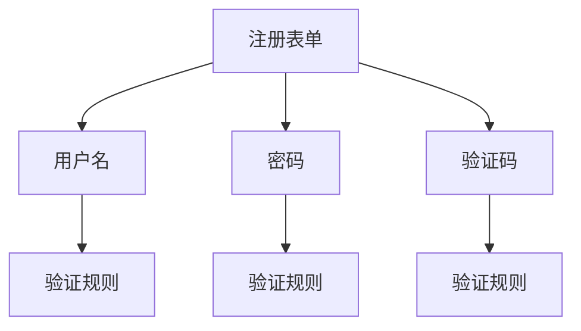
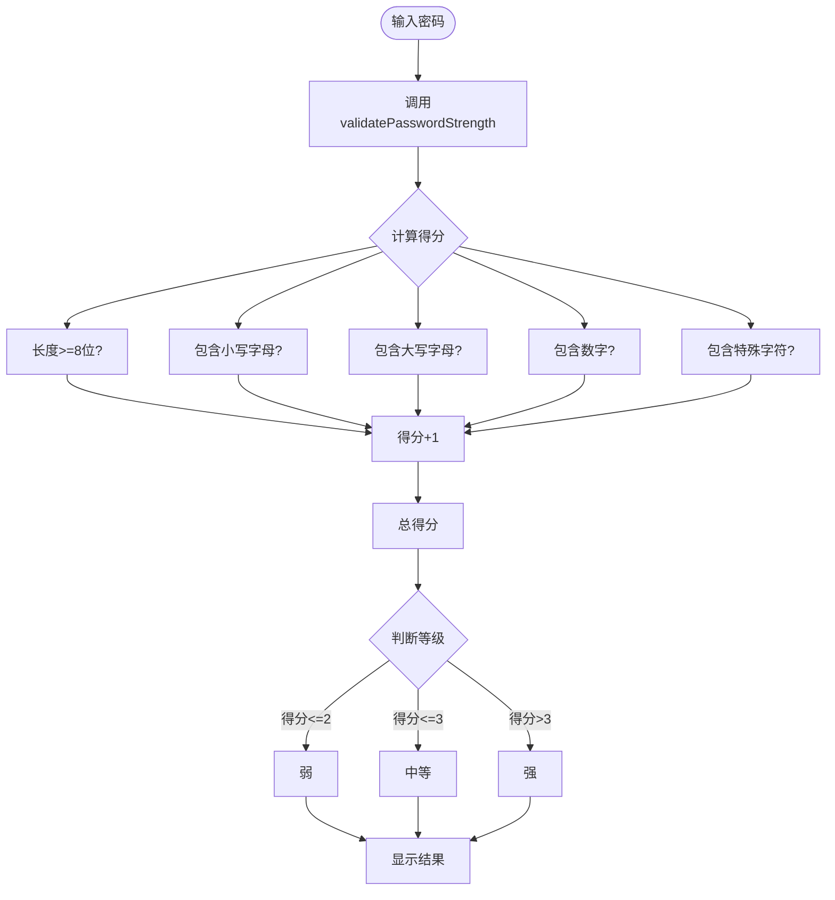
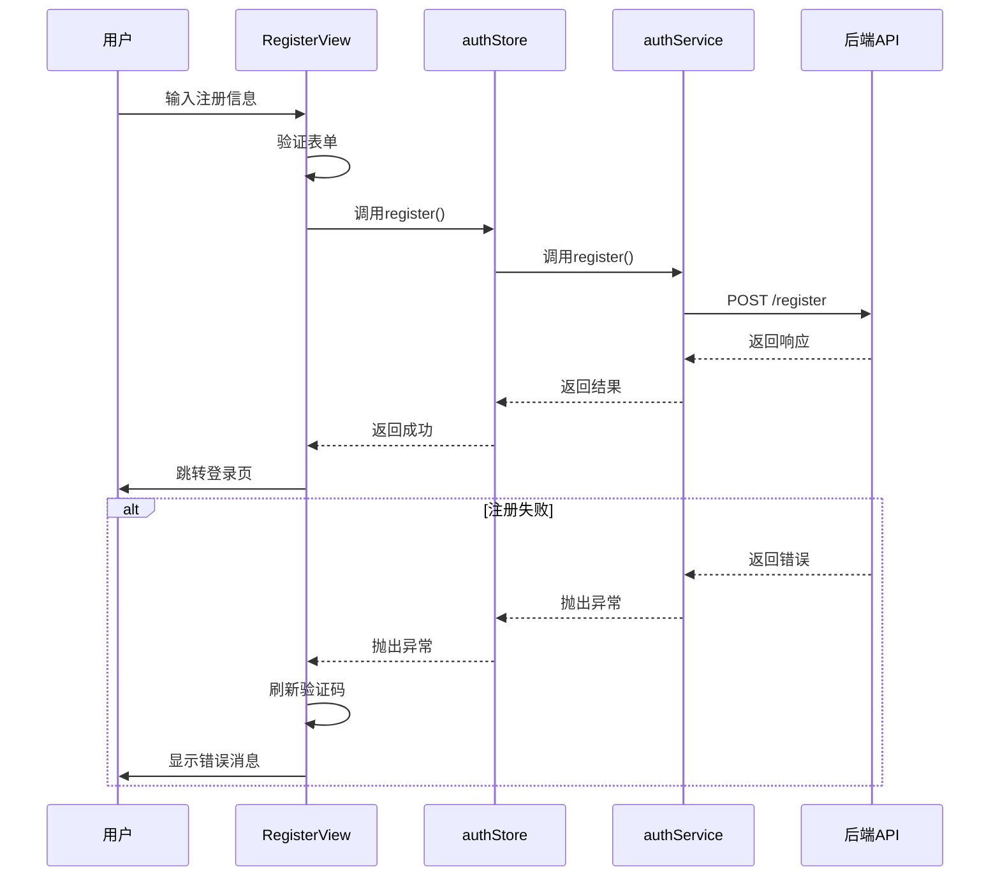
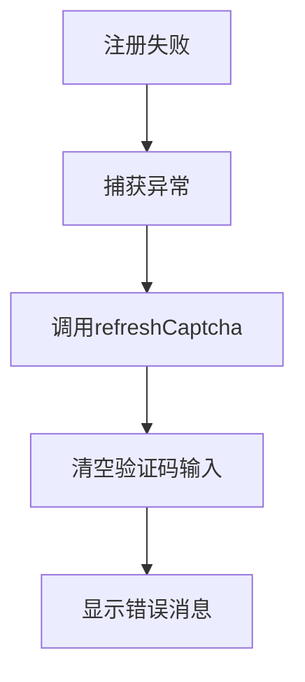

# 注册功能

<cite>
**Referenced Files in This Document**   
- [RegisterView.vue](file://src/views/auth/RegisterView.vue)
- [auth.ts](file://src/stores/auth.ts)
- [auth.ts](file://src/services/auth.ts)
- [index.ts](file://src/utils/index.ts)
- [REGISTER_API_INTEGRATION.md](file://REGISTER_API_INTEGRATION.md)
</cite>

## 目录
1. [注册表单结构与设计](#注册表单结构与设计)
2. [密码强度提示器实现](#密码强度提示器实现)
3. [注册流程分析](#注册流程分析)
4. [验证码机制](#验证码机制)
5. [错误处理策略](#错误处理策略)

## 注册表单结构与设计

`RegisterView` 组件采用简化设计，仅保留核心注册字段，提升用户体验。表单结构经过精心设计，聚焦于必要信息收集。



**Diagram sources**
- [RegisterView.vue](file://src/views/auth/RegisterView.vue#L83-L87)

**Section sources**
- [RegisterView.vue](file://src/views/auth/RegisterView.vue#L83-L87)
- [REGISTER_API_INTEGRATION.md](file://REGISTER_API_INTEGRATION.md#L63-L81)

### 简化字段设计

注册表单仅包含三个核心字段：

- **用户名**：用户身份的唯一标识
- **密码**：账户安全的关键凭证
- **验证码**：防止自动化攻击的安全验证

### 业务考量

根据 `REGISTER_API_INTEGRATION.md` 文档，移除邮箱、手机号等字段主要基于以下业务考量：

1. **降低注册门槛**：简化流程，提高用户注册转化率
2. **聚焦核心功能**：初期版本优先实现基础认证功能
3. **数据最小化原则**：遵循隐私保护最佳实践，只收集必要信息
4. **分阶段实施**：后续可通过个人资料完善流程补充其他信息

### 表单验证规则

表单实现了严格的客户端验证，确保输入数据的质量和安全性。

**Section sources**
- [RegisterView.vue](file://src/views/auth/RegisterView.vue#L104-L118)

## 密码强度提示器实现

密码强度提示器为用户提供实时反馈，帮助创建更安全的密码，是提升账户安全性的关键功能。



**Diagram sources**
- [index.ts](file://src/utils/index.ts#L173-L207)

**Section sources**
- [RegisterView.vue](file://src/views/auth/RegisterView.vue#L90-L92)
- [index.ts](file://src/utils/index.ts#L173-L207)

### 实现逻辑

密码强度计算通过 `validatePasswordStrength` 工具函数实现，该函数位于 `src/utils/index.ts` 文件中。

#### 核心算法

函数通过五个维度评估密码强度，每个维度满足条件则得1分，总分5分：

1. **长度检查**：密码长度至少8位
2. **小写字母**：包含至少一个小写字母
3. **大写字母**：包含至少一个大写字母
4. **数字**：包含至少一个数字
5. **特殊字符**：包含至少一个特殊字符（!@#$%^&*(),.?":{}|<>）

#### 强度等级划分

根据总得分划分三个等级：

- **弱**：得分 ≤ 2
- **中等**：得分 ≤ 3
- **强**：得分 > 3

#### 实时计算

在 `RegisterView.vue` 中，`passwordStrength` 是一个计算属性，它依赖于 `registerForm.password` 的值，当用户输入密码时会自动重新计算：

```typescript
const passwordStrength = computed(() => {
  return validatePasswordStrength(registerForm.password)
})
```

## 注册流程分析

注册流程采用清晰的分步处理机制，确保用户操作的顺畅和系统的稳定性。



**Diagram sources**
- [RegisterView.vue](file://src/views/auth/RegisterView.vue#L153-L194)
- [auth.ts](file://src/stores/auth.ts#L100-L108)
- [auth.ts](file://src/services/auth.ts#L147-L172)

**Section sources**
- [RegisterView.vue](file://src/views/auth/RegisterView.vue#L153-L194)
- [auth.ts](file://src/stores/auth.ts#L100-L108)
- [auth.ts](file://src/services/auth.ts#L147-L172)

### 流程步骤

1. **用户提交**：用户点击注册按钮，触发 `handleRegister` 方法
2. **表单验证**：通过 `registerFormRef.value.validate()` 验证所有字段
3. **参数准备**：收集用户名、密码、验证码和验证码UUID
4. **服务调用**：通过 `authStore.register()` 触发注册请求
5. **结果处理**：根据响应结果跳转或显示错误

### 核心方法

`handleRegister` 方法是注册流程的入口点，它协调了表单验证、API调用和结果处理。

**Section sources**
- [RegisterView.vue](file://src/views/auth/RegisterView.vue#L153-L194)

## 验证码机制

验证码机制是注册功能的重要安全组件，有效防止自动化脚本的滥用。

### 获取与刷新

验证码在页面加载时自动获取，并支持手动刷新。

**Section sources**
- [RegisterView.vue](file://src/views/auth/RegisterView.vue#L131-L139)
- [RegisterView.vue](file://src/views/auth/RegisterView.vue#L142-L144)

#### 自动获取

页面初始化时调用 `init()` 函数，自动获取验证码：

```typescript
const init = async () => {
  await getCaptcha()
}
```

#### 手动刷新

用户点击验证码图片或注册失败时，会调用 `refreshCaptcha()` 方法刷新验证码。

### 失败后自动刷新

注册失败后自动刷新验证码是重要的用户体验优化，防止因验证码失效导致的连续失败。



**Diagram sources**
- [RegisterView.vue](file://src/views/auth/RegisterView.vue#L153-L194)

## 错误处理策略

系统实现了全面的错误处理机制，为用户提供清晰的反馈和恢复路径。

### 典型错误处理

#### 用户名已存在

当后端返回"用户名已存在"错误时，系统会：

1. 显示具体的错误消息
2. 保留用户名和密码输入
3. 自动刷新验证码
4. 清空验证码输入框

#### 验证码失效

当验证码失效时，系统会：

1. 显示"验证码错误"或"验证码已过期"消息
2. 自动获取新的验证码
3. 提示用户输入新的验证码

### 处理建议

针对常见错误，建议采取以下措施：

1. **用户名已存在**：建议用户尝试其他用户名，或直接登录
2. **验证码失效**：系统已自动处理，用户只需输入新验证码
3. **网络错误**：提示用户检查网络连接后重试
4. **服务器错误**：记录错误日志，提示用户稍后重试

**Section sources**
- [RegisterView.vue](file://src/views/auth/RegisterView.vue#L153-L194)
- [REGISTER_API_INTEGRATION.md](file://REGISTER_API_INTEGRATION.md#L158-L173)