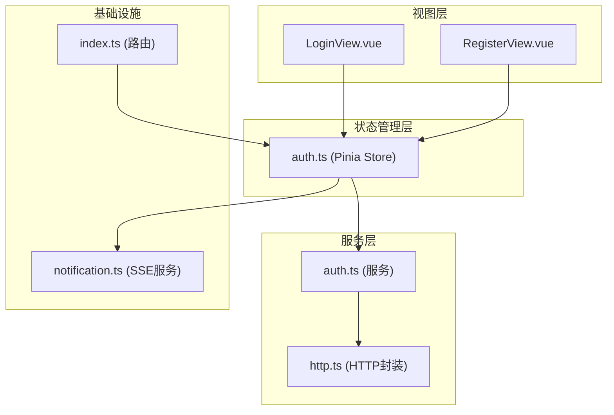
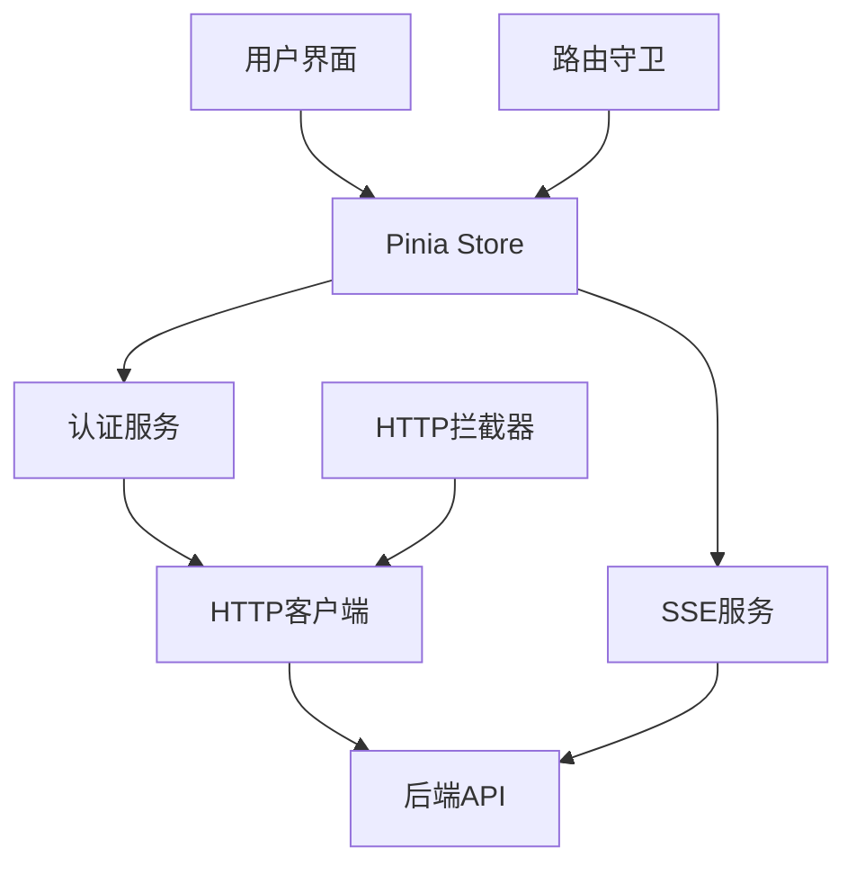
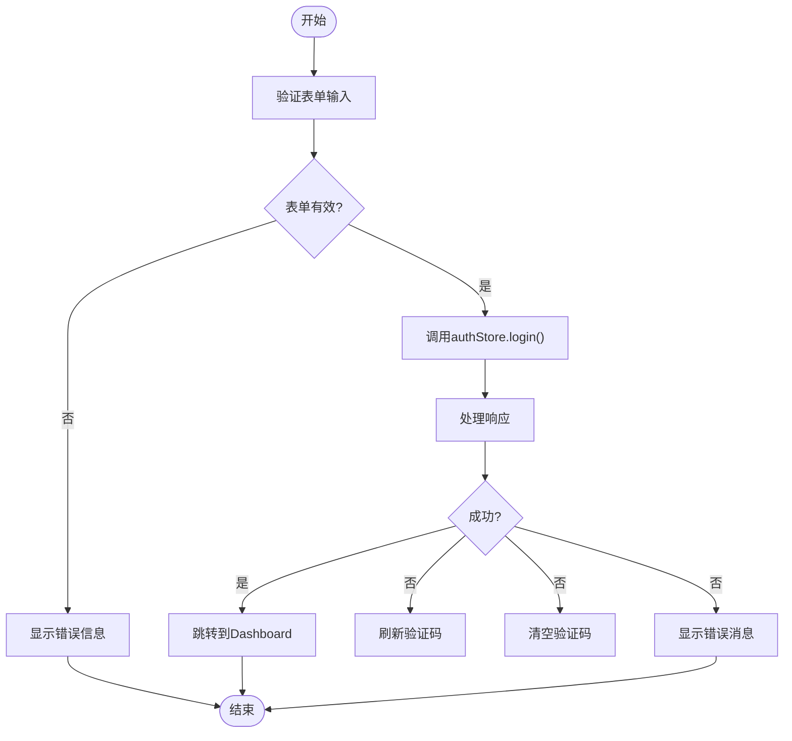
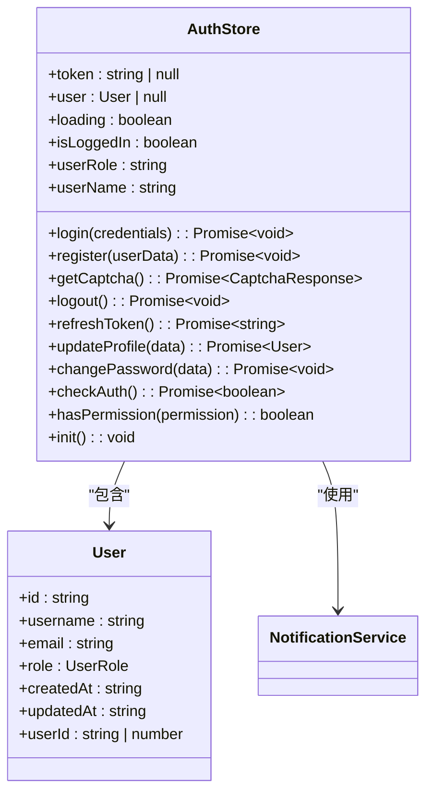
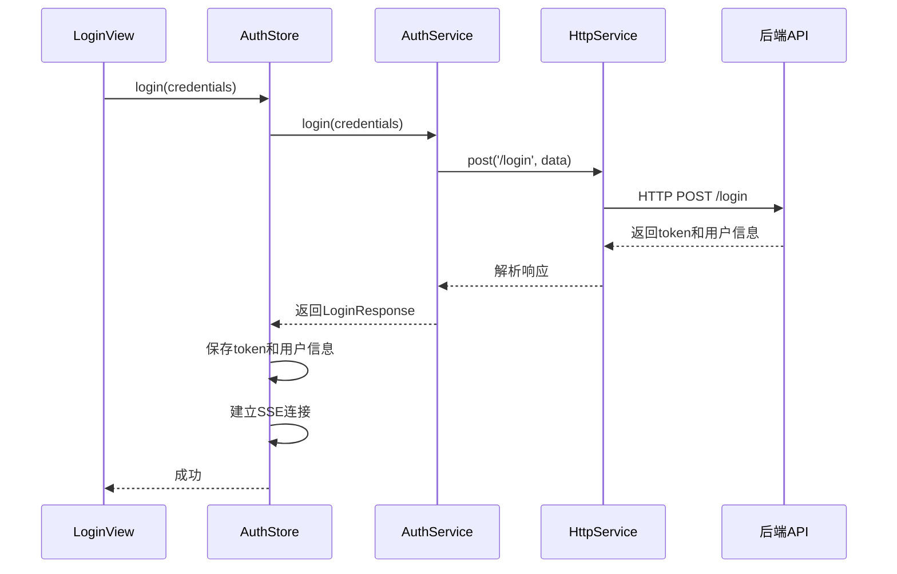
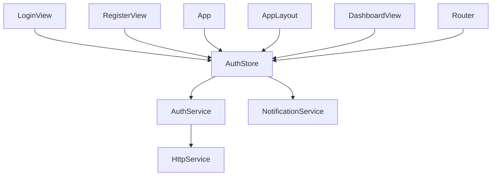

# 认证系统

<cite>
**本文档引用的文件**  
- [LoginView.vue](file://src/views/auth/LoginView.vue)
- [RegisterView.vue](file://src/views/auth/RegisterView.vue)
- [auth.ts](file://src/services/auth.ts)
- [auth.ts](file://src/stores/auth.ts)
- [http.ts](file://src/services/http.ts)
- [notification.ts](file://src/services/notification.ts)
- [index.ts](file://src/router/index.ts)
- [App.vue](file://src/App.vue)
- [API_INTEGRATION.md](file://API_INTEGRATION.md)
- [LOGIN_CAPTCHA_INTEGRATION.md](file://LOGIN_CAPTCHA_INTEGRATION.md)
- [REGISTER_API_INTEGRATION.md](file://REGISTER_API_INTEGRATION.md)
- [TOKEN_FIX.md](file://TOKEN_FIX.md)
- [TOKEN_AUTO_REDIRECT.md](file://TOKEN_AUTO_REDIRECT.md)
- [SSE_TOKEN_AUTH_CHANGE.md](file://SSE_TOKEN_AUTH_CHANGE.md)
</cite>

## 目录
1. [简介](#简介)
2. [项目结构](#项目结构)
3. [核心组件](#核心组件)
4. [架构概述](#架构概述)
5. [详细组件分析](#详细组件分析)
6. [依赖分析](#依赖分析)
7. [性能考虑](#性能考虑)
8. [故障排除指南](#故障排除指南)
9. [结论](#结论)

## 简介
本系统为专利服务平台提供完整的用户认证解决方案，涵盖注册、登录、验证码、会话管理及安全控制全流程。系统采用Vue 3 + Pinia + Element Plus技术栈，通过JWT实现无状态认证，并集成SSE（Server-Sent Events）实现实时通知功能。认证流程包含严格的表单验证、安全的token管理机制和自动化的会话维护，确保用户身份的安全性和用户体验的流畅性。

## 项目结构
系统采用标准的Vue 3项目结构，认证相关组件集中于`src/views/auth`目录，状态管理使用Pinia存储于`src/stores/auth.ts`，服务层逻辑封装在`src/services/auth.ts`。整体结构清晰，职责分离明确，便于维护和扩展。

**图示来源**  
- [LoginView.vue](file://src/views/auth/LoginView.vue)
- [RegisterView.vue](file://src/views/auth/RegisterView.vue)
- [auth.ts](file://src/stores/auth.ts)
- [auth.ts](file://src/services/auth.ts)
- [http.ts](file://src/services/http.ts)
- [notification.ts](file://src/services/notification.ts)
- [index.ts](file://src/router/index.ts)

## 核心组件
系统核心组件包括登录视图、注册视图、认证Store、认证服务和HTTP拦截器。LoginView和RegisterView负责用户界面交互和表单验证，auth store管理用户状态和JWT token，auth service处理与后端API的通信，http.ts中的拦截器自动处理认证头和错误响应。这些组件协同工作，实现了安全、可靠的用户认证流程。

**本节来源**  
- [LoginView.vue](file://src/views/auth/LoginView.vue)
- [RegisterView.vue](file://src/views/auth/RegisterView.vue)
- [auth.ts](file://src/stores/auth.ts)
- [auth.ts](file://src/services/auth.ts)
- [http.ts](file://src/services/http.ts)

## 架构概述
系统采用分层架构，从上至下分为视图层、状态管理层、服务层和基础设施层。视图层通过Pinia Store与服务层交互，服务层通过封装的HTTP客户端与后端API通信。认证状态全局管理，确保一致性。SSE服务在用户登录后自动建立连接，实现服务器推送。整个架构支持可扩展性和可维护性，各层职责清晰，耦合度低。

**图示来源**  
- [auth.ts](file://src/stores/auth.ts)
- [auth.ts](file://src/services/auth.ts)
- [http.ts](file://src/services/http.ts)
- [notification.ts](file://src/services/notification.ts)
- [index.ts](file://src/router/index.ts)

## 详细组件分析

### 登录与注册视图分析
LoginView和RegisterView是用户认证的入口，实现表单验证、用户输入处理和提交逻辑。两者均采用Element Plus组件库，提供一致的用户体验。

#### 表单验证与提交流程

**图示来源**  
- [LoginView.vue](file://src/views/auth/LoginView.vue#L148-L148)
- [RegisterView.vue](file://src/views/auth/RegisterView.vue#L75-L75)

**本节来源**  
- [LoginView.vue](file://src/views/auth/LoginView.vue)
- [RegisterView.vue](file://src/views/auth/RegisterView.vue)

### 认证状态管理分析
auth store是认证系统的核心，使用Pinia实现响应式状态管理，集中管理token、用户信息和认证状态。

#### 状态管理类图

**图示来源**  
- [auth.ts](file://src/stores/auth.ts#L1-L262)
- [types/index.ts](file://src/types/index.ts#L27-L31)

**本节来源**  
- [auth.ts](file://src/stores/auth.ts)
- [types/index.ts](file://src/types/index.ts)

### 认证服务与API交互分析
auth service封装了与后端认证API的交互细节，提供统一的接口供上层调用。

#### 认证服务序列图

**图示来源**  
- [auth.ts](file://src/services/auth.ts#L29-L246)
- [auth.ts](file://src/stores/auth.ts#L50-L100)

**本节来源**  
- [auth.ts](file://src/services/auth.ts)
- [auth.ts](file://src/stores/auth.ts)

## 依赖分析
系统依赖关系清晰，各组件间通过定义良好的接口交互。视图组件依赖auth store，store依赖auth service，service依赖http client。这种分层依赖确保了低耦合和高内聚，便于单元测试和维护。

**图示来源**  
- [LoginView.vue](file://src/views/auth/LoginView.vue#L148-L148)
- [RegisterView.vue](file://src/views/auth/RegisterView.vue#L75-L75)
- [App.vue](file://src/App.vue#L6-L6)
- [AppLayout.vue](file://src/layouts/AppLayout.vue#L22-L22)
- [DashboardView.vue](file://src/views/DashboardView.vue#L232-L232)
- [index.ts](file://src/router/index.ts#L245-L245)
- [auth.ts](file://src/stores/auth.ts)
- [auth.ts](file://src/services/auth.ts)
- [http.ts](file://src/services/http.ts)
- [notification.ts](file://src/services/notification.ts)

**本节来源**  
- [LoginView.vue](file://src/views/auth/LoginView.vue)
- [RegisterView.vue](file://src/views/auth/RegisterView.vue)
- [App.vue](file://src/App.vue)
- [AppLayout.vue](file://src/layouts/AppLayout.vue)
- [DashboardView.vue](file://src/views/DashboardView.vue)
- [index.ts](file://src/router/index.ts)
- [auth.ts](file://src/stores/auth.ts)
- [auth.ts](file://src/services/auth.ts)
- [http.ts](file://src/services/http.ts)
- [notification.ts](file://src/services/notification.ts)

## 性能考虑
系统在性能方面做了多项优化。HTTP请求设置120秒超时，适应AI报告生成等长时间操作。SSE连接使用fetch + ReadableStream实现，支持自定义请求头，确保认证安全。token自动刷新机制减少用户重新登录的频率，提升用户体验。验证码采用Base64内联图片，减少HTTP请求次数。

## 故障排除指南

### 常见认证问题排查
1. **登录失败**
   - 检查用户名密码是否正确
   - 确认验证码输入正确且未过期
   - 检查网络连接是否正常
   - 查看浏览器控制台是否有错误信息

2. **Token失效**
   - 确认token是否过期（检查tokenExpireTime）
   - 检查localStorage中的token格式是否正确
   - 验证后端返回的token是否包含双引号
   - 查看HTTP拦截器日志，确认Authorization头是否正确设置

3. **SSE连接失败**
   - 确认用户已登录并获取有效token
   - 检查token是否通过Authorization请求头正确传递
   - 验证CORS配置是否允许Authorization头
   - 查看浏览器控制台SSE连接日志

4. **页面跳转异常**
   - 检查路由守卫逻辑
   - 确认redirect参数是否正确传递
   - 验证token过期跳转逻辑是否正常工作

**本节来源**  
- [TOKEN_FIX.md](file://TOKEN_FIX.md)
- [TOKEN_AUTO_REDIRECT.md](file://TOKEN_AUTO_REDIRECT.md)
- [SSE_TOKEN_AUTH_CHANGE.md](file://SSE_TOKEN_AUTH_CHANGE.md)
- [http.ts](file://src/services/http.ts)
- [auth.ts](file://src/stores/auth.ts)

## 结论
本认证系统设计完整，实现了从用户注册、登录到会话管理的全流程。系统采用现代化的前端架构，结合Pinia状态管理、Vue Router路由控制和SSE实时通信，提供了安全、可靠、用户体验良好的认证解决方案。通过详细的文档和清晰的代码结构，系统易于维护和扩展，为专利服务平台的稳定运行提供了坚实的基础。