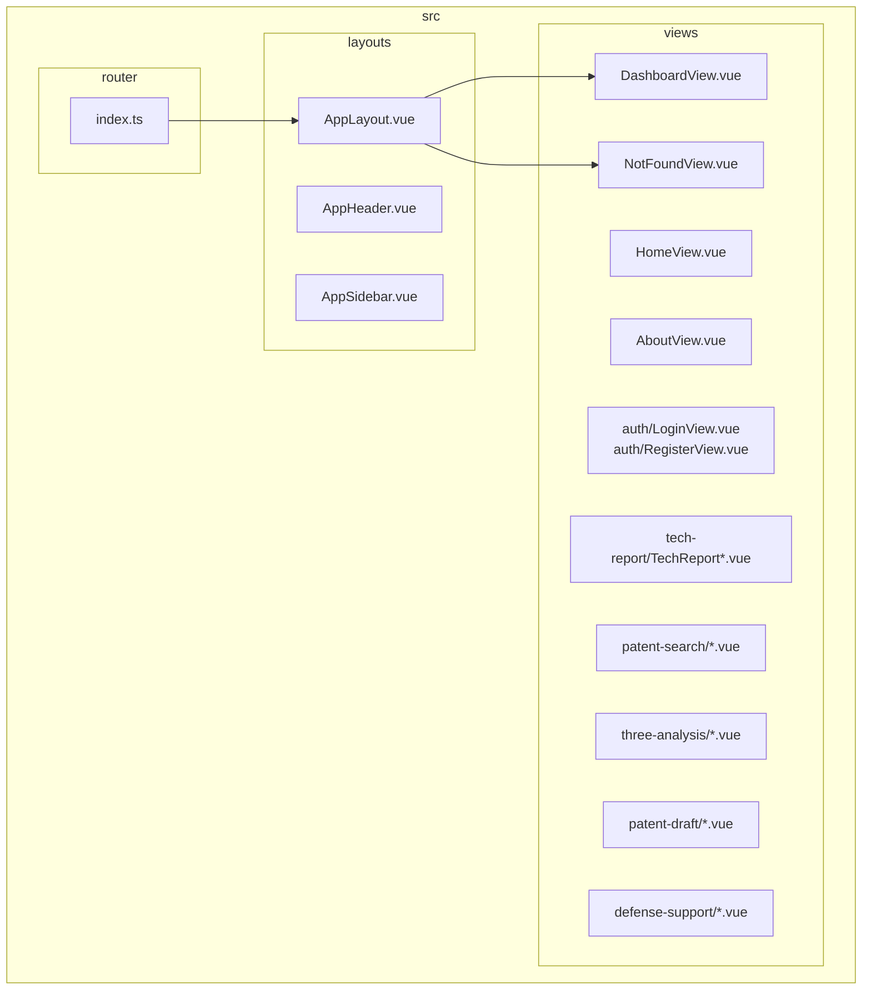
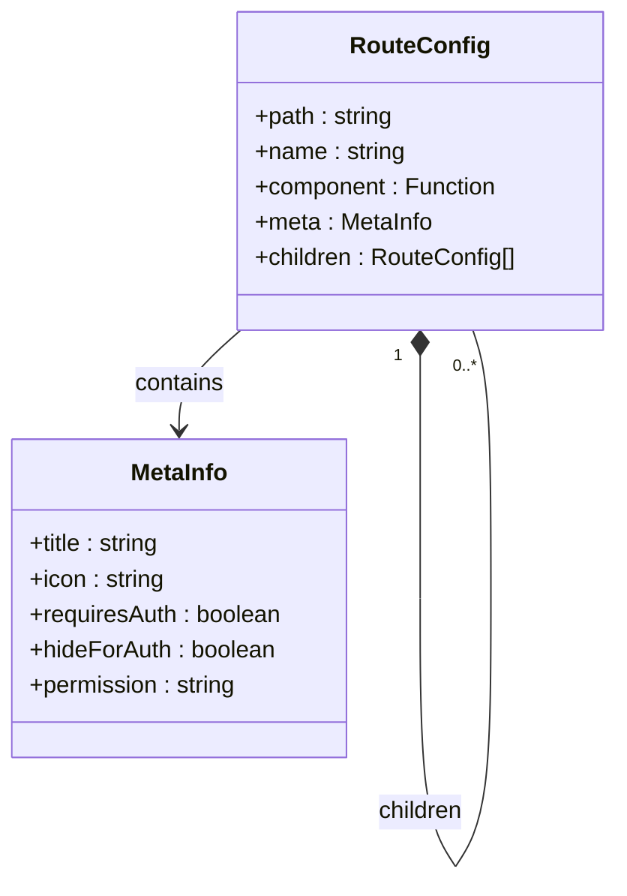
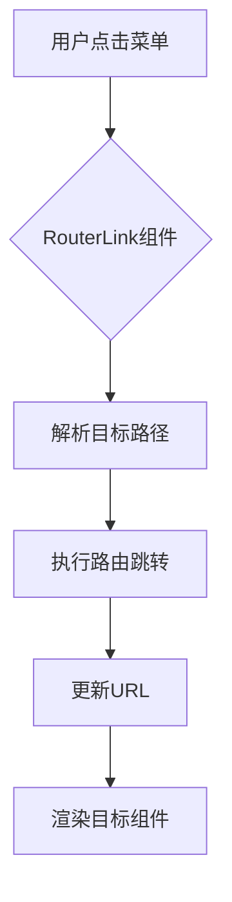
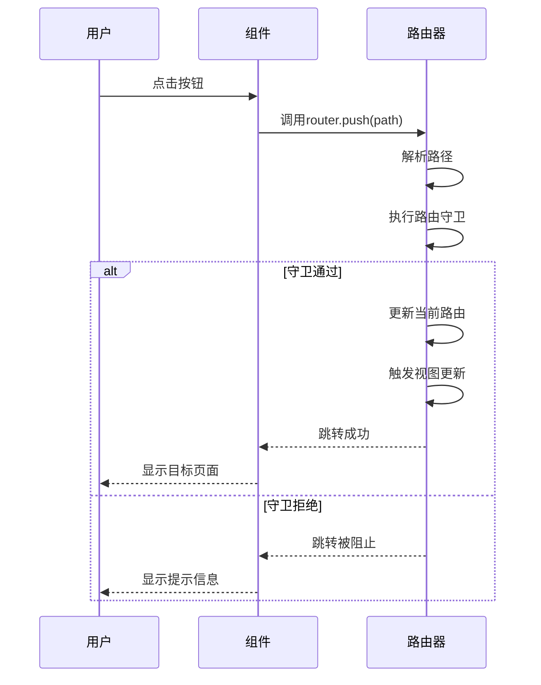
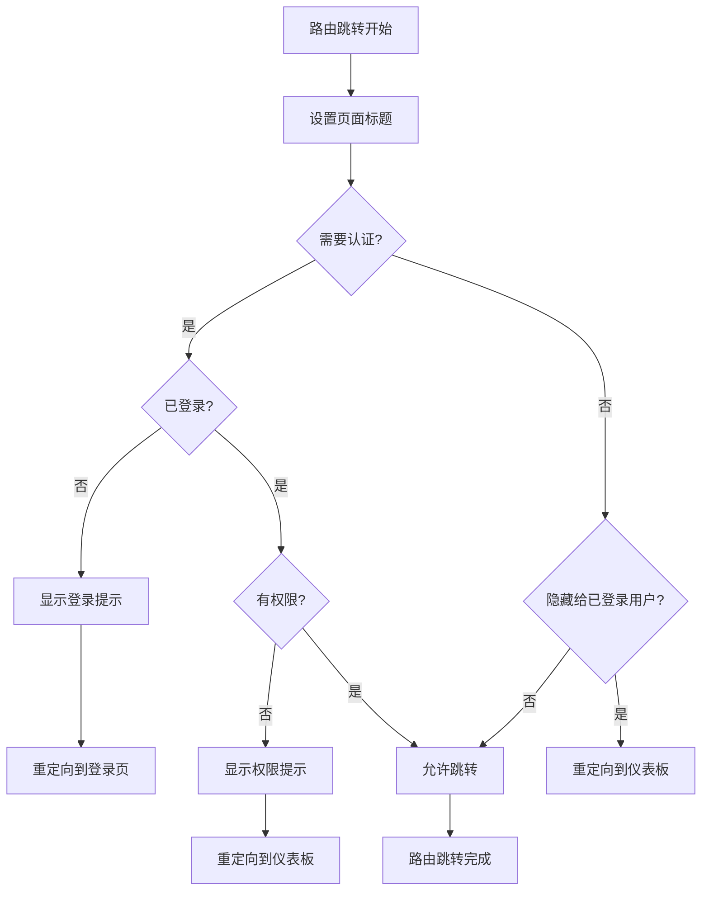

# 路由与导航

<cite>
**本文档引用的文件**
- [index.ts](file://src/router/index.ts)
- [AppLayout.vue](file://src/layouts/AppLayout.vue)
- [DashboardView.vue](file://src/views/DashboardView.vue)
- [NotFoundView.vue](file://src/views/NotFoundView.vue)
- [LoginView.vue](file://src/views/auth/LoginView.vue)
- [QuickSearchView.vue](file://src/views/patent-search/QuickSearchView.vue)
- [PatentDraftManageView.vue](file://src/views/patent-draft/PatentDraftManageView.vue)
</cite>

## 目录
1. [项目结构](#项目结构)
2. [路由表结构](#路由表结构)
3. [导航逻辑](#导航逻辑)
4. [编程式导航应用](#编程式导航应用)
5. [路由守卫实现](#路由守卫实现)
6. [路由调试与错误排查](#路由调试与错误排查)

## 项目结构



**图示来源**
- [index.ts](file://src/router/index.ts#L1-L293)
- [AppLayout.vue](file://src/layouts/AppLayout.vue#L1-L184)

## 路由表结构

专利服务平台的路由系统采用Vue Router 4.x版本，基于TypeScript构建，实现了模块化、层次化的路由配置。路由表定义在`src/router/index.ts`文件中，采用`RouteRecordRaw`类型进行类型约束，确保路由配置的类型安全。

路由配置主要包含以下特性：

1. **路径映射**：通过`path`属性定义URL路径，支持静态路径和动态参数路径
2. **组件懒加载**：使用`import()`函数实现路由组件的懒加载，优化首屏加载性能
3. **嵌套路由**：通过`children`属性实现多级嵌套路由结构
4. **路由元信息**：通过`meta`属性附加路由的额外信息，如标题、图标、权限要求等



**图示来源**
- [index.ts](file://src/router/index.ts#L1-L293)

### 核心路由配置

路由系统采用分层结构，主要分为以下几个部分：

1. **根路径重定向**：将根路径`/`重定向到`/app/dashboard`，确保用户访问根路径时能正确跳转到仪表板页面
2. **认证相关路由**：包含登录`/login`和注册`/register`页面，这些页面不需要认证即可访问
3. **应用主路由**：以`/app`为前缀的受保护路由，需要用户登录后才能访问
4. **通配符路由**：`/:pathMatch(.*)*`用于捕获所有未匹配的路径，显示404页面

受保护的`/app`路由使用`AppLayout`作为布局组件，该布局包含头部导航和侧边栏，为所有子页面提供统一的界面框架。

**节来源**
- [index.ts](file://src/router/index.ts#L15-L293)

## 导航逻辑

系统的导航逻辑设计遵循清晰的用户路径，确保用户能够顺畅地在不同功能模块间切换。导航主要通过两种方式实现：声明式导航和编程式导航。

### 声明式导航

声明式导航主要通过`<router-link>`组件实现，在`AppLayout.vue`的侧边栏菜单中使用。菜单项配置与路由配置保持一致，点击菜单项时自动触发路由跳转。



**图示来源**
- [AppLayout.vue](file://src/layouts/AppLayout.vue#L30-L94)

### 页面间导航关系

系统主要页面间的导航关系如下：

```mermaid
graph LR
Login[/login] --> Dashboard[/app/dashboard]
Register[/register] --> Login
Dashboard --> TechReport[/app/tech-report]
Dashboard --> PatentSearch[/app/patent-search]
Dashboard --> ThreeAnalysis[/app/three-analysis]
Dashboard --> PatentDraft[/app/patent-draft]
Dashboard --> DefenseSupport[/app/defense-support]
Dashboard --> Profile[/app/profile]
TechReport --> TechReportNew[/app/tech-report/new]
TechReport --> TechReportHistory[/app/tech-report/history]
TechReport --> TechReportDetail[/app/tech-report/:id]
PatentSearch --> QuickSearch[/app/patent-search/quick]
PatentSearch --> Results[/app/patent-search/results]
ThreeAnalysis --> ThreeAnalysisNew[/app/three-analysis/new]
ThreeAnalysis --> ThreeAnalysisHistory[/app/three-analysis/history]
ThreeAnalysis --> ThreeAnalysisDetail[/app/three-analysis/:id]
PatentDraft --> PatentDraftNew[/app/patent-draft/new]
PatentDraft --> PatentDraftManage[/app/patent-draft/manage]
PatentDraft --> PatentDraftEdit[/app/patent-draft/edit/:id]
DefenseSupport --> Simulation[/app/defense-support/simulation]
AllPages --> NotFound[404页面]
```

**图示来源**
- [index.ts](file://src/router/index.ts#L15-L293)

## 编程式导航应用

编程式导航在系统中广泛应用，通过`$router.push()`方法实现动态路由跳转。这种方式在需要根据用户交互或业务逻辑动态决定跳转目标时特别有用。

### 典型应用场景

1. **快捷操作按钮**：在仪表板页面的快捷操作区域，点击"新建技术方案报告"按钮直接跳转到新建报告页面
2. **表单提交后跳转**：在登录表单提交成功后，根据重定向参数跳转到指定页面
3. **错误处理跳转**：在404页面提供返回首页或返回上一页的按钮
4. **列表项点击**：在各种列表页面中，点击列表项跳转到详情页面



**图示来源**
- [DashboardView.vue](file://src/views/DashboardView.vue#L14-L17)
- [NotFoundView.vue](file://src/views/NotFoundView.vue#L17-L18)

### 具体实现示例

在`DashboardView.vue`中，快捷操作按钮使用编程式导航：

```typescript
// 快捷操作 - 新建技术方案报告
<el-button @click="$router.push('/app/tech-report/new')">
  新建技术方案报告
</el-button>

// 快捷操作 - 专利检索
<el-button @click="$router.push('/app/patent-search/quick')">
  专利检索
</el-button>
```

在`PatentDraftManageView.vue`中，新建草稿按钮也使用了编程式导航：

```typescript
<el-button @click="$router.push('/app/patent-draft/new')">
  新建草稿
</el-button>
```

**节来源**
- [DashboardView.vue](file://src/views/DashboardView.vue#L14-L17)
- [PatentDraftManageView.vue](file://src/views/patent-draft/PatentDraftManageView.vue#L34-L35)

## 路由守卫实现

路由守卫是系统安全控制的核心机制，确保用户只能访问其有权限的页面。系统实现了全局前置守卫`beforeEach`，在每次路由跳转前进行权限验证。

### 守卫逻辑流程



**图示来源**
- [index.ts](file://src/router/index.ts#L238-L292)

### 守卫功能详解

1. **页面标题设置**：根据路由的`meta.title`属性动态设置页面标题，提升用户体验
2. **认证检查**：对于需要认证的页面（`requiresAuth: true`），检查用户登录状态
3. **访问控制**：对于已登录用户，禁止访问登录和注册页面（`hideForAuth: true`）
4. **权限验证**：检查用户是否具有访问特定页面的权限（`permission`属性）
5. **错误处理**：全局捕获路由错误，显示友好的错误提示

当用户尝试访问需要认证的页面但未登录时，系统会显示"请先登录"的提示，并将用户重定向到登录页面，同时保存原始访问路径，以便登录成功后自动跳转。

**节来源**
- [index.ts](file://src/router/index.ts#L238-L292)

## 路由调试与错误排查

### 常见路由错误及解决方案

1. **404错误**：页面不存在
   - 检查路由路径是否正确拼写
   - 确认路由配置中是否包含对应路径
   - 检查组件路径是否正确
   - 验证动态参数命名是否匹配

2. **空白页面**：组件未正确加载
   - 检查懒加载语法是否正确：`component: () => import('...')`
   - 确认组件文件是否存在且路径正确
   - 检查组件导出是否正确

3. **权限问题**：无法访问受保护页面
   - 确认用户是否已登录
   - 检查`requiresAuth`配置是否正确
   - 验证用户权限是否满足要求

4. **重定向循环**：页面不断重定向
   - 检查路由守卫逻辑是否存在死循环
   - 确认重定向路径是否正确
   - 验证登录状态管理是否正常

### 调试技巧

1. **启用路由日志**：在开发环境中可以添加路由日志，观察路由跳转过程
2. **使用Vue Devtools**：通过Vue开发者工具检查当前路由状态和路由历史
3. **检查控制台错误**：关注控制台中的路由相关错误信息
4. **验证路由配置**：确保路由配置的完整性和正确性，特别是嵌套路由的配置
5. **测试边界情况**：测试未登录用户访问受保护页面、已登录用户访问登录页面等边界情况

系统已配置路由错误处理，当发生路由错误时会捕获异常并显示"页面加载失败"的提示，提升用户体验。

**节来源**
- [index.ts](file://src/router/index.ts#L285-L292)
- [NotFoundView.vue](file://src/views/NotFoundView.vue#L1-L91)