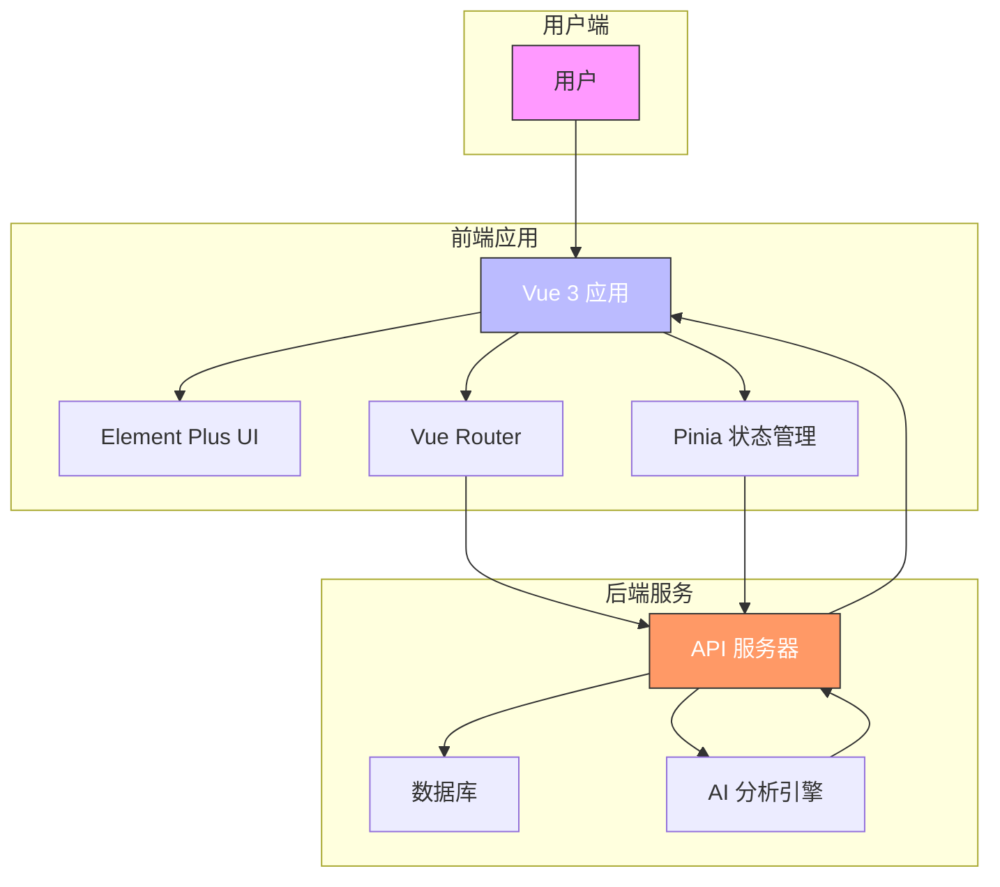

# 项目概述

<cite>
**本文档引用文件**  
- [README-new.md](file://README-new.md)
- [main.ts](file://src/main.ts)
- [router/index.ts](file://src/router/index.ts)
- [services/techReport.ts](file://src/services/techReport.ts)
- [services/patentSearch.ts](file://src/services/patentSearch.ts)
- [services/patentDraft.ts](file://src/services/patentDraft.ts)
- [services/threeAnalysis.ts](file://src/services/threeAnalysis.ts)
- [services/defenseSupport.ts](file://src/services/defenseSupport.ts)
- [App.vue](file://src/App.vue)
- [AppLayout.vue](file://src/layouts/AppLayout.vue)
- [types/index.ts](file://src/types/index.ts)
</cite>

## 目录
1. [项目简介](#项目简介)
2. [核心功能](#核心功能)
3. [技术架构](#技术架构)
4. [系统上下文图](#系统上下文图)
5. [项目结构](#项目结构)
6. [技术栈](#技术栈)
7. [目标用户与应用场景](#目标用户与应用场景)
8. [开发与部署](#开发与部署)

## 项目简介

专利服务网站是一个基于Vue 3的现代化一站式专利服务平台，致力于为用户提供高效、智能的知识产权服务。项目采用前后端分离架构，通过集成AI技术，实现了从专利检索、技术方案分析到专利撰写和答辩支持的全流程服务。平台旨在降低专利申请门槛，提升专利撰写质量，为科研人员、企业研发团队和知识产权服务机构提供专业支持。

平台以用户为中心，提供直观的操作界面和智能化的功能引导，帮助用户快速完成复杂的专利相关工作。通过自动化报告生成、智能分析和模板化撰写等功能，显著提升了专利工作的效率和专业性。

**Section sources**
- [README-new.md](file://README-new.md#L1-L50)

## 核心功能

### 专利检索
平台提供快速检索和高级检索两种模式，支持通过关键词、发明人、申请人等多维度进行专利文献查询。用户可保存检索历史并收藏感兴趣的专利，便于后续跟踪和分析。检索功能与后端API深度集成，确保检索结果的准确性和实时性。

### 技术方案报告生成
用户输入技术领域描述后，系统可自动生成专业的技术方案分析报告。报告包含技术背景、技术问题、解决方案、有益效果等核心内容，为专利撰写提供坚实基础。平台支持文本输入和文件上传两种方式，满足不同场景需求。

### 专利撰写
提供步骤化的专利撰写向导，内置多种专利类型模板，支持实时预览和草稿保存。用户可逐步完成说明书、权利要求书等核心内容的撰写，系统提供智能提示和格式校验，确保专利文件的规范性。

### 三性分析
平台提供全面的新颖性、创造性、实用性分析服务。通过与现有技术的对比分析，评估技术方案的专利性，并生成综合评估报告，包含评分、风险提示和改进建议，帮助用户优化技术方案。

### 答辩支持
提供模拟审查和答辩策略建议功能，帮助用户准备专利审查意见答复。系统可分析审查意见，提供针对性的答复思路和模板，提高答辩成功率。

**Section sources**
- [README-new.md](file://README-new.md#L51-L150)

## 技术架构

项目采用标准的MVVM（Model-View-ViewModel）架构模式，基于Vue 3的组合式API实现组件逻辑。通过Pinia进行全局状态管理，Vue Router实现路由控制，形成清晰的前后端分离架构。

前端项目以`main.ts`为入口，初始化Vue应用并注册Element Plus组件库和Pinia状态管理。`App.vue`作为根组件，通过`RouterView`实现路由视图的动态加载。`AppLayout.vue`提供统一的页面布局，包含头部导航和侧边栏菜单。

各功能模块通过独立的服务层（services）与后端API交互，如`techReportService`、`patentSearchService`等，实现了业务逻辑与界面展示的分离。类型定义统一管理在`types`目录下，确保类型安全。

**Section sources**
- [main.ts](file://src/main.ts#L1-L24)
- [App.vue](file://src/App.vue#L1-L26)
- [AppLayout.vue](file://src/layouts/AppLayout.vue#L30-L94)
- [types/index.ts](file://src/types/index.ts#L1-L74)

## 系统上下文图

**Diagram sources**
- [main.ts](file://src/main.ts#L1-L24)
- [router/index.ts](file://src/router/index.ts#L1-L294)
- [services/techReport.ts](file://src/services/techReport.ts#L1-L345)

## 项目结构

项目采用功能模块化的目录结构，清晰划分不同职责的代码文件。`src`目录下包含核心源码，其中`views`目录按功能划分页面组件，`services`目录封装API服务，`stores`目录管理应用状态。

- `assets`：静态资源文件
- `components`：通用UI组件
- `layouts`：页面布局组件
- `router`：路由配置
- `services`：API服务层
- `stores`：状态管理
- `types`：类型定义
- `utils`：工具函数
- `views`：页面视图组件

这种结构提高了代码的可维护性和可扩展性，便于团队协作开发。

**Section sources**
- [README-new.md](file://README-new.md#L151-L200)

## 技术栈

### 前端框架
- **Vue 3**：采用Composition API和响应式系统
- **TypeScript**：提供静态类型检查
- **Vite**：现代化构建工具，提供快速热更新

### 状态管理
- **Pinia**：Vue 3官方推荐的状态管理库，替代Vuex

### UI组件库
- **Element Plus**：基于Vue 3的桌面端组件库
- **@element-plus/icons-vue**：官方图标库

### 路由管理
- **Vue Router 4**：官方路由解决方案，支持动态路由和懒加载

### 网络请求
- **Axios**：基于Promise的HTTP客户端，封装在`services/http.ts`中

### 样式处理
- **SCSS**：CSS预处理器，支持嵌套和变量
- **CSS Variables**：原生CSS变量，实现主题切换

### 其他工具
- **ECharts**：数据可视化图表库
- **Quill**：富文本编辑器
- **Vitest**：单元测试框架

**Section sources**
- [README-new.md](file://README-new.md#L94-L149)

## 目标用户与应用场景

### 目标用户
- **科研人员**：需要将研究成果转化为专利的技术人员
- **企业研发团队**：负责企业知识产权布局的工程师
- **专利代理人**：提供专业专利服务的中介机构
- **高校师生**：从事学术研究和技术创新的教育工作者

### 应用场景
- **技术研发初期**：通过专利检索了解技术现状，避免重复研发
- **专利申请准备**：利用技术报告生成和三性分析功能，评估技术方案的专利性
- **专利撰写过程**：使用模板化撰写工具，提高专利文件质量
- **审查意见答复**：借助答辩支持功能，高效应对专利审查
- **知识产权管理**：集中管理企业的专利资产和申请流程

平台通过智能化功能降低专利工作的专业门槛，让非专业人士也能完成高质量的专利申请，同时为专业人士提供效率工具，全面提升知识产权服务的质量和效率。

**Section sources**
- [README-new.md](file://README-new.md#L1-L230)

## 开发与部署

### 开发环境
- Node.js >= 20.19.0
- npm >= 10.0.0
- VS Code + Volar插件（推荐）

### 开发流程
1. 安装依赖：`npm install`
2. 启动开发服务器：`npm run dev`
3. 访问：http://localhost:5180

### 构建与部署
- 构建生产版本：`npm run build`
- 代码检查：`npm run lint`
- 类型检查：`npm run type-check`
- 运行测试：`npm run test`

项目已配置完整的CI/CD流程，支持自动化测试和部署，确保代码质量和发布稳定性。

**Section sources**
- [README-new.md](file://README-new.md#L151-L230)