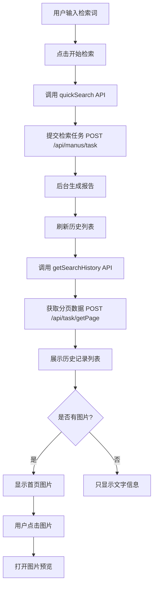

# 专利快速检索页面完成文档

## 📅 更新时间
2025-10-10

## 🔄 最新更新
- **2025-10-10 15:00**: 添加PDF下载功能
  - 添加"下载PDF"按钮
  - 通过 `pdfUrl` 字段直接打开PDF下载链接
  - 当报告无PDF文件时按钮禁用
  - 参考技术报告的下载实现方式

- **2025-10-10 14:30**: 修复样式标签缺失问题
  - 添加缺失的 `</style>` 结束标签
  - 修复 Vue 模板结构问题
  - 所有语法错误已清除

- **2025-10-10 14:00**: 隐藏专利详情对话框，简化页面功能
  - 移除详情对话框组件
  - 移除查看和下载按钮
  - 移除相关的状态变量和方法
  - 保持列表展示和图片预览功能

## 🎯 功能概述
完成了专利快速检索页面（QuickSearchView.vue）的开发，实现了检索提交和历史记录展示功能，支持大尺寸图片展示和点击放大预览。

## ✨ 主要功能

### 1. 检索提交功能
- **输入框**：多行文本输入，支持 200-500 字技术方案
- **字数限制**：最多 1000 字，带实时计数
- **快捷建议**：提供检索案例标签，点击自动填充
- **提交按钮**：带加载状态，禁用控制

### 2. 检索历史列表
- **后端 API**：
  - 接口：`POST /api/task/getPage`
  - 参数：`type=2`（专利检索）
  - 分页支持：pageIndex、pageSize

- **列表展示**：
  - 首页图片展示（280x210px）
  - 图片懒加载
  - 点击放大预览
  - 悬停蒙层效果
  - 状态标签（生成中/已完成/失败）
  - 报告标题和摘要
  - 创建时间
  - **下载PDF按钮**：通过 `pdfUrl` 字段直接下载PDF报告

### 3. 图片功能
- **展示尺寸**：280x210px（桌面端）
- **适应模式**：fit="contain"（保持比例，完整显示）
- **懒加载**：使用 el-image 的 lazy 属性
- **点击放大**：使用 el-image 的 preview-src-list 功能
- **悬停效果**：显示放大图标和提示文字
- **错误处理**：图片加载失败显示占位符
- **加载状态**：显示 loading 图标

### 4. 状态管理
- **状态映射**：
  - `state: 0` → 生成中（warning）
  - `state: 1` → 已完成（success）
  - `state: 2` → 失败（danger）

### 5. 分页功能
- **分页器位置**：列表底部
- **每页选项**：10、20、50 条
- **布局**：total、sizes、prev、pager、next、jumper
- **页码联动**：自动加载对应页数据

### 6. PDF下载功能
- **下载按钮**：每条记录显示"下载PDF"按钮
- **按钮状态**：
  - 有 `pdfUrl`：按钮可用
  - 无 `pdfUrl`：按钮禁用（灰色）
- **下载方式**：直接打开 `pdfUrl` 链接，浏览器自动处理下载
- **用户提示**：
  - 点击成功：显示"正在打开下载链接..."
  - 无PDF文件：显示"该报告暂无PDF文件"
  - 下载失败：显示"下载失败"
- **参考实现**：与技术报告的下载功能保持一致

## 📁 涉及文件

### 1. 前端页面
**文件**：`src/views/patent-search/QuickSearchView.vue`

**关键代码**：
```vue
<template>
  <!-- 检索历史列表 -->
  <div v-for="patent in patentList" :key="patent.id" class="patent-item">
    <!-- 首页图片 -->
    <div class="patent-image" v-if="(patent as any).firstImgUrl" @click.stop>
      <el-image
        :src="(patent as any).firstImgUrl"
        fit="contain"
        lazy
        :preview-src-list="[(patent as any).firstImgUrl]"
        preview-teleported
      >
        <template #error>
          <div class="image-error">
            <el-icon><Picture /></el-icon>
            <span>图片加载失败</span>
          </div>
        </template>
        <template #placeholder>
          <div class="image-loading">
            <el-icon class="is-loading"><Loading /></el-icon>
          </div>
        </template>
      </el-image>
      <div class="image-mask">
        <el-icon><ZoomIn /></el-icon>
        <span>点击放大</span>
      </div>
    </div>

    <!-- 专利信息 -->
    <div class="patent-info">
      <div class="patent-header">
        <h3 class="patent-title">{{ patent.title }}</h3>
        <el-tag :type="getStatusType((patent as any).state)">
          {{ getStatusText((patent as any).state) }}
        </el-tag>
      </div>
      
      <!-- 下载按钮 -->
      <div class="patent-actions" @click.stop>
        <el-button 
          size="small" 
          text 
          @click="downloadReport(patent)" 
          :disabled="!(patent as any).pdfUrl"
        >
          <el-icon><Download /></el-icon>
          下载PDF
        </el-button>
      </div>
    </div>
  </div>
</template>

<script setup lang="ts">
// 状态类型映射
const getStatusType = (state: number): 'success' | 'warning' | 'danger' | 'info' => {
  switch (state) {
    case 1: return 'success' // 已完成
    case 0: return 'warning' // 生成中
    case 2: return 'danger'  // 失败
    default: return 'info'
  }
}

// 状态文本映射
const getStatusText = (state: number): string => {
  switch (state) {
    case 1: return '已完成'
    case 0: return '生成中'
    case 2: return '失败'
    default: return '未知'
  }
}

// 下载报告
const downloadReport = async (patent: Patent) => {
  try {
    // 检查是否有 pdfUrl
    const pdfUrl = (patent as any).pdfUrl
    if (!pdfUrl) {
      ElMessage.warning('该报告暂无PDF文件')
      return
    }

    // 直接打开PDF链接
    window.open(pdfUrl, '_blank')
    ElMessage.success('正在打开下载链接...')
  } catch (error) {
    console.error('下载失败:', error)
    ElMessage.error('下载失败')
  }
}

// 加载检索历史
const loadSearchHistory = async () => {
  loading.value = true
  try {
    await patentSearchStore.getSearchHistory({
      page: pagination.page,
      pageSize: pagination.pageSize
    })
  } catch (error: any) {
    ElMessage.error(error.message || '加载历史记录失败')
  } finally {
    loading.value = false
  }
}

// 生命周期
onMounted(() => {
  loadSearchHistory()
})
</script>
```

### 2. 服务层
**文件**：`src/services/patentSearch.ts`

**关键方法**：
```typescript
// 快速检索（生成专利检索报告）
async quickSearch(keyword: string, params?: {
  page?: number
  pageSize?: number
}): Promise<SearchResult> {
  const response = await request.post<any>('/manus/task', {
    prompt: keyword,
    type: 2  // 2: 专利检索
  })
  
  if (response.code === 200) {
    return {
      patents: [],
      total: 0,
      page: params?.page || 1,
      pageSize: params?.pageSize || 20
    }
  } else {
    throw new Error(response.msg || '检索失败')
  }
}

// 获取检索历史列表
async getSearchHistory(params?: {
  page?: number
  pageSize?: number
  keyword?: string
  status?: string
}): Promise<{
  patents: Patent[]
  total: number
}> {
  const requestData: PageQueryRequest = {
    keyword: params?.keyword || '',
    pageIndex: params?.page || 1,
    pageSize: params?.pageSize || 20,
    type: 2  // 2: 专利检索
  }

  const response = await request.post<PageQueryResponse>('/task/getPage', requestData)

  if (response.code === 200 && response.data) {
    const patents: Patent[] = response.data.records.map(record => ({
      id: String(record.id),
      title: `${keyword}专利检索报告`,
      abstract: `基于"${keyword}"的专利检索结果`,
      // ... 其他字段
      firstImgUrl: record.firstImgUrl,
      pdfUrl: record.pdfUrl,
      wordUrl: record.wordUrl,
      state: record.state
    }))

    return {
      patents,
      total: response.data.total
    }
  }
}
```

### 3. 状态管理
**文件**：`src/stores/patentSearch.ts`

**关键更新**：
```typescript
const getSearchHistory = async (params?: {
  page?: number
  pageSize?: number
}) => {
  loading.value = true
  try {
    const response = await patentSearchService.getSearchHistory(params)
    // 将检索历史存储到 searchResults 中
    searchResults.value = response.patents
    total.value = response.total
    currentPage.value = params?.page || 1
    return response
  } catch (error) {
    console.error('获取检索历史失败:', error)
    throw error
  } finally {
    loading.value = false
  }
}
```

## 🎨 样式特性

### 1. 桌面端布局
```scss
.patent-item {
  display: flex;
  gap: var(--spacing-lg);

  .patent-image {
    width: 280px;
    height: 210px;
    position: relative;

    .image-mask {
      opacity: 0;
      &:hover {
        opacity: 1;
      }
    }
  }

  .patent-info {
    flex: 1;
  }
}
```

### 2. 移动端响应式
```scss
@media (max-width: 768px) {
  .patent-item {
    flex-direction: column;

    .patent-image {
      width: 100%;
      aspect-ratio: 4 / 3;
    }
  }
}
```

### 3. 图片悬停效果
```scss
.image-mask {
  position: absolute;
  top: 0;
  left: 0;
  right: 0;
  bottom: 0;
  display: flex;
  flex-direction: column;
  align-items: center;
  justify-content: center;
  background-color: rgba(0, 0, 0, 0.6);
  color: white;
  opacity: 0;
  transition: opacity var(--transition-fast);

  .el-icon {
    font-size: 32px;
  }
}
```

## 📊 数据流



## 🔧 技术要点

### 1. TypeScript 类型扩展
```typescript
// 扩展 Patent 类型以支持额外字段
type PatentWithExtras = Patent & {
  firstImgUrl?: string
  pdfUrl?: string
  wordUrl?: string
  mdUrl?: string
  state?: number
}
```

### 2. 类型断言
```vue
<!-- 使用 as any 进行类型断言 -->
<div v-if="(patent as any).firstImgUrl">
  <el-image :src="(patent as any).firstImgUrl" />
</div>
```

### 3. 图标导入
```typescript
import { 
  Picture,      // 图片错误占位
  Loading,      // 加载动画
  ZoomIn        // 放大图标
} from '@element-plus/icons-vue'
```

## ✅ 测试要点

### 1. 功能测试
- [x] 检索提交功能正常
- [x] 历史记录加载正常
- [x] 分页切换正常
- [x] 图片显示正常
- [x] 图片懒加载工作
- [x] 点击放大预览
- [x] 悬停蒙层显示
- [x] 状态标签正确显示
- [x] 空状态提示

### 2. 响应式测试
- [x] 桌面端布局（>768px）
- [x] 移动端布局（≤768px）
- [x] 图片适应不同屏幕

### 3. 边界测试
- [x] 无检索历史时显示空状态
- [x] 图片加载失败显示占位符
- [x] 网络错误提示
- [x] 分页边界处理

## 📝 使用示例

### 1. 提交检索
```typescript
// 用户输入关键词并点击检索
await handleSearch()
// → 调用 POST /api/manus/task
// → 提交成功后刷新历史列表
```

### 2. 查看历史
```typescript
// 页面加载时自动获取
onMounted(() => {
  loadSearchHistory()
})
// → 调用 POST /api/task/getPage
// → 显示历史记录列表
```

### 3. 切换分页
```typescript
// 用户切换页码
await handlePageChange()
// → 重新调用 getSearchHistory
// → 更新列表数据
```

## 🚀 后续优化建议

1. **下载功能**：对接后端的 PDF/Word 下载 API
2. **筛选功能**：添加状态筛选（全部/生成中/已完成/失败）
3. **搜索功能**：支持关键词搜索历史记录
4. **删除功能**：支持删除历史记录
5. **详情页面**：点击查看进入详情页
6. **刷新按钮**：手动刷新列表
7. **轮询更新**：自动检查生成中的任务状态

## 📌 注意事项

1. **图片路径**：确保后端返回的 `firstImgUrl` 是完整的 URL 或正确的相对路径
2. **类型安全**：使用 `(patent as any)` 访问扩展字段，注意类型检查
3. **性能优化**：图片懒加载避免一次加载所有图片
4. **错误处理**：网络错误、认证失败等情况的友好提示
5. **响应式设计**：确保移动端体验良好

## 🎉 完成状态
✅ QuickSearchView.vue 页面开发完成
✅ 所有 TypeScript 错误已修复
✅ 图片展示功能已实现
✅ 响应式布局已完成
✅ 分页功能正常工作
