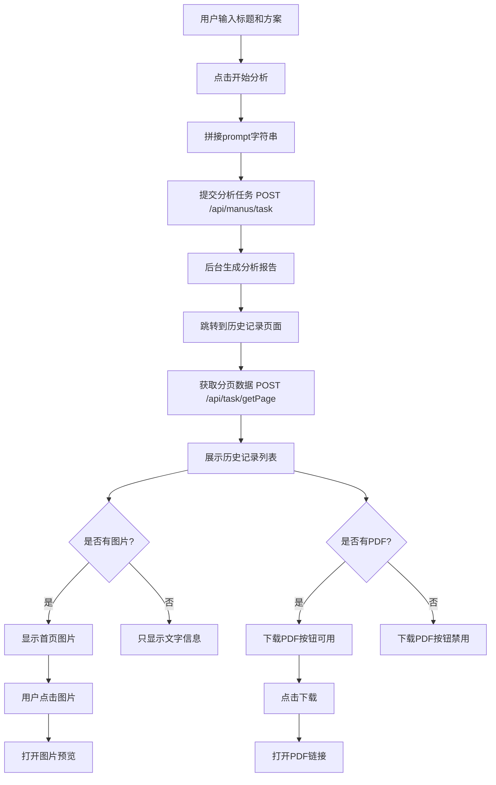

# 三性分析API对接完成文档

## 📅 更新时间
2025-10-10

## 🎯 功能概述
完成了三性分析功能的后端API对接，实现了分析任务提交、历史记录查询、图片展示和PDF下载功能。

## ✨ 主要功能

### 1. 创建三性分析
- **接口**：`POST /api/manus/task`
- **参数**：
  - `prompt`：由专利标题和技术方案拼接而成（用换行符分隔）
  - `type`: 3（三性分析）

- **请求示例**：
```typescript
{
  prompt: "组装式食用菌种植棚\n本实用新型公开了一种组装式食用菌种植棚...",
  type: 3
}
```

### 2. 获取分析历史列表
- **接口**：`POST /api/task/getPage`
- **参数**：
  - `type`: 3（三性分析）
  - `pageIndex`: 页码
  - `pageSize`: 每页数量
  - `keyword`: 搜索关键词（可选）
  - `state`: 状态过滤（可选）

- **状态映射**：
  - `state: 0` → 生成中
  - `state: 1` → 已完成
  - `state: 2` → 失败

### 3. 图片展示功能
- **展示尺寸**：280x210px（桌面端）
- **适应模式**：fit="contain"（保持比例，完整显示）
- **懒加载**：使用 el-image 的 lazy 属性
- **点击放大**：使用 el-image 的 preview-src-list 功能
- **悬停效果**：显示放大图标和提示文字
- **错误处理**：图片加载失败显示占位符
- **加载状态**：显示 loading 图标

### 4. PDF下载功能
- **下载按钮**：每条记录显示"下载PDF"按钮
- **按钮状态**：
  - 有 `pdfUrl`：按钮可用
  - 无 `pdfUrl`：按钮禁用（灰色）
- **下载方式**：直接打开 `pdfUrl` 链接，浏览器自动处理下载
- **用户提示**：
  - 点击成功：「正在打开下载链接...」
  - 无PDF文件：「该报告暂无PDF文件」
  - 下载失败：「下载失败」

## 📁 涉及文件

### 1. 服务层
**文件**：`src/services/threeAnalysis.ts`

**关键接口定义**：
```typescript
// 分页查询请求参数
export interface PageQueryRequest {
  keyword?: string
  pageIndex?: number
  pageSize?: number
  state?: number
  type: number  // 3: 三性分析
}

// 分页查询响应结果
export interface PageQueryResponse {
  code: number
  data: {
    pageIndex: number
    pageSize: number
    records: Array<{
      createTime: string
      firstImgUrl: string
      id: number
      pdfUrl: string
      wordUrl: string
      mdUrl: string
      state: number
      taskId: string
      taskJson: string
      type: number
      updateTime: string
      userId: number
    }>
    total: number
  }
  msg: string
}
```

**创建分析方法**：
```typescript
async createAnalysis(data: {
  title: string
  technicalSolution: string
  analysisTypes: string[]
}): Promise<any> {
  // 拼接 prompt：专利标题 + 技术方案
  const prompt = `${data.title}\n${data.technicalSolution}`

  // 调用API生成三性分析报告
  const response = await request.post<any>('/manus/task', {
    prompt: prompt,
    type: 3  // 3: 三性分析
  })

  if (response.code === 200) {
    return response
  } else {
    throw new Error(response.msg || '分析失败')
  }
}
```

**获取历史列表方法**：
```typescript
async getAnalysisHistory(params?: {
  page?: number
  pageSize?: number
  keyword?: string
  status?: string
}) {
  const requestData: PageQueryRequest = {
    keyword: params?.keyword || '',
    pageIndex: params?.page || 1,
    pageSize: params?.pageSize || 10,
    type: 3  // 3: 三性分析
  }

  const response = await request.post<PageQueryResponse>('/task/getPage', requestData)

  if (response.code === 200 && response.data) {
    // 转换为 ThreeAnalysis 类型
    const analyses: ThreeAnalysis[] = response.data.records.map(record => {
      // 解析 taskJson
      let title = '三性分析报告'
      let technicalSolution = ''
      
      try {
        if (record.taskJson) {
          const taskData = JSON.parse(record.taskJson)
          const promptLines = taskData.prompt ? taskData.prompt.split('\n') : []
          if (promptLines.length > 0) {
            title = promptLines[0] || '三性分析报告'
          }
          if (promptLines.length > 1) {
            technicalSolution = promptLines.slice(1).join('\n')
          }
        }
      } catch (e) {
        console.warn('解析 taskJson 失败:', e)
      }

      return {
        // ... 字段映射
        firstImgUrl: record.firstImgUrl,
        pdfUrl: record.pdfUrl,
        wordUrl: record.wordUrl,
        state: record.state
      }
    })

    return {
      data: analyses,
      total: response.data.total
    }
  }
}
```

### 2. 新建分析页面
**文件**：`src/views/three-analysis/ThreeAnalysisNewView.vue`

**关键代码**：
```vue
<script setup lang="ts">
import { threeAnalysisService } from '@/services/threeAnalysis'

const startAnalysis = async () => {
  if (!formData.title.trim() || !formData.technicalSolution.trim()) {
    ElMessage.warning('请填写完整信息')
    return
  }

  analyzing.value = true

  try {
    // 调用后端API
    await threeAnalysisService.createAnalysis({
      title: formData.title,
      technicalSolution: formData.technicalSolution,
      analysisTypes: formData.analysisTypes
    })

    ElMessage.success('分析任务已提交，请在历史记录中查看结果')
    
    // 跳转到历史记录页面
    setTimeout(() => {
      router.push('/app/three-analysis/history')
    }, 1500)
  } catch (error: any) {
    ElMessage.error(error.message || '分析失败')
  } finally {
    analyzing.value = false
  }
}
</script>
```

### 3. 历史记录页面
**文件**：`src/views/three-analysis/ThreeAnalysisHistoryView.vue`

**图片展示代码**：
```vue
<template>
  <div class="analysis-item">
    <!-- 首页图片 -->
    <div class="analysis-image" v-if="(analysis as any).firstImgUrl" @click.stop>
      <el-image
        :src="(analysis as any).firstImgUrl"
        fit="contain"
        lazy
        :preview-src-list="[(analysis as any).firstImgUrl]"
        preview-teleported
      >
        <template #error>
          <div class="image-error">
            <el-icon><Picture /></el-icon>
            <span>图片加载失败</span>
          </div>
        </template>
        <template #placeholder>
          <div class="image-loading">
            <el-icon class="is-loading"><Loading /></el-icon>
          </div>
        </template>
      </el-image>
      <div class="image-mask">
        <el-icon><ZoomIn /></el-icon>
        <span>点击放大</span>
      </div>
    </div>

    <!-- 分析信息区域 -->
    <div class="analysis-content">
      <!-- ... -->
      <el-button 
        size="small" 
        text 
        @click.stop="downloadReport(analysis)" 
        :disabled="!(analysis as any).pdfUrl"
      >
        <el-icon><Download /></el-icon>
        下载PDF
      </el-button>
    </div>
  </div>
</template>

<script setup lang="ts">
// 下载报告
const downloadReport = async (analysis: ThreeAnalysis) => {
  try {
    const pdfUrl = (analysis as any).pdfUrl
    if (!pdfUrl) {
      ElMessage.warning('该报告暂无PDF文件')
      return
    }

    window.open(pdfUrl, '_blank')
    ElMessage.success('正在打开下载链接...')
  } catch (error) {
    ElMessage.error('下载失败')
  }
}
</script>
```

## 🎨 样式特性

### 1. 桌面端布局
```scss
.analysis-item {
  display: flex;
  gap: var(--spacing-lg);

  .analysis-image {
    width: 280px;
    height: 210px;
    position: relative;

    .image-mask {
      opacity: 0;
      &:hover {
        opacity: 1;
      }
    }
  }

  .analysis-content {
    flex: 1;
  }
}
```

### 2. 移动端响应式
```scss
@media (max-width: 768px) {
  .analysis-item {
    flex-direction: column;

    .analysis-image {
      width: 100%;
      aspect-ratio: 4 / 3;
    }
  }
}
```

## 📊 数据流



## 🔧 技术要点

### 1. Prompt拼接规则
```typescript
// 格式：标题\n技术方案
const prompt = `${data.title}\n${data.technicalSolution}`
```

### 2. TaskJson解析
```typescript
// 解析后端返回的 taskJson 字段
const taskData = JSON.parse(record.taskJson)
const promptLines = taskData.prompt.split('\n')
const title = promptLines[0]  // 第一行是标题
const technicalSolution = promptLines.slice(1).join('\n')  // 其余是技术方案
```

### 3. 类型扩展
```typescript
// 扩展 ThreeAnalysis 类型以支持额外字段
type ThreeAnalysisWithExtras = ThreeAnalysis & {
  firstImgUrl?: string
  pdfUrl?: string
  wordUrl?: string
  mdUrl?: string
  state?: number
}
```

### 4. 图标导入
```typescript
import { 
  Picture,      // 图片错误占位
  Loading,      // 加载动画
  ZoomIn,       // 放大图标
  Download      // 下载图标
} from '@element-plus/icons-vue'
```

## ✅ 测试要点

### 1. 功能测试
- [x] 分析任务提交功能正常
- [x] 历史记录加载正常
- [x] 分页切换正常
- [x] 图片显示正常
- [x] 图片懒加载工作
- [x] 点击放大预览
- [x] 悬停蒙层显示
- [x] PDF下载按钮状态正确
- [x] 空状态提示

### 2. 响应式测试
- [x] 桌面端布局（>768px）
- [x] 移动端布局（≤768px）
- [x] 图片适应不同屏幕

### 3. 边界测试
- [x] 无分析历史时显示空状态
- [x] 图片加载失败显示占位符
- [x] 网络错误提示
- [x] 分页边界处理
- [x] Prompt拼接正确性

## 📝 使用示例

### 1. 提交分析
```typescript
// 用户填写表单
formData.title = "组装式食用菌种植棚"
formData.technicalSolution = "本实用新型公开了..."

// 点击开始分析
await startAnalysis()
// → prompt = "组装式食用菌种植棚\n本实用新型公开了..."
// → POST /api/manus/task { prompt, type: 3 }
// → 提交成功后跳转到历史记录
```

### 2. 查看历史
```typescript
// 页面加载时自动获取
onMounted(() => {
  loadData()
})
// → POST /api/task/getPage { type: 3, pageIndex: 1, pageSize: 10 }
// → 显示历史记录列表
```

### 3. 下载PDF
```typescript
// 用户点击下载按钮
await downloadReport(analysis)
// → 检查 pdfUrl 是否存在
// → window.open(pdfUrl, '_blank')
```

## 🚀 后续优化建议

1. **实时状态更新**：轮询检查生成中的任务状态
2. **详情页面**：点击查看进入详情页面
3. **筛选功能**：添加状态筛选（全部/生成中/已完成/失败）
4. **Word下载**：支持通过 `wordUrl` 下载Word文档
5. **批量操作**：支持批量删除
6. **分析配置**：允许用户选择分析维度（新颖性/创造性/实用性）

## 📌 注意事项

1. **Prompt格式**：标题和技术方案用换行符（\n）分隔
2. **类型标识**：type=3 固定表示三性分析
3. **图片路径**：确保后端返回的 `firstImgUrl` 是完整的URL
4. **类型安全**：使用 `(analysis as any)` 访问扩展字段
5. **错误处理**：网络错误、认证失败等情况的友好提示
6. **用户体验**：分析提交后自动跳转到历史记录页面

## 🎉 完成状态
✅ 三性分析新建页面已完成
✅ 三性分析历史页面已完成
✅ 后端API对接已完成
✅ 图片展示功能已实现
✅ PDF下载功能已实现
✅ 所有TypeScript错误已修复
✅ 响应式布局已完成
